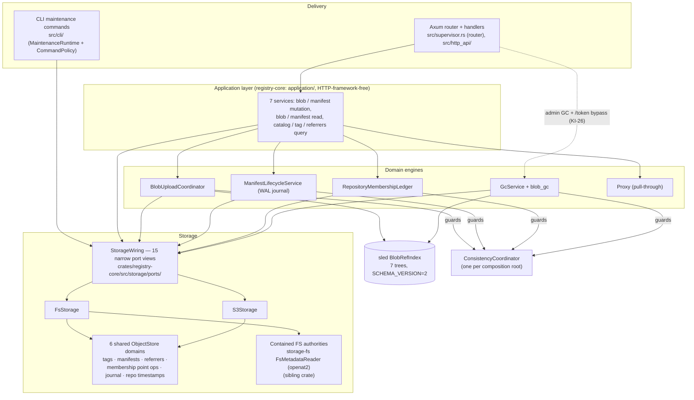
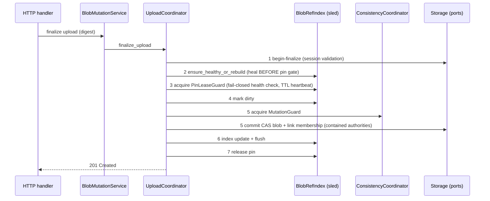

# Current architecture

- **Role:** canonical description of what `registry-rust` implements — components, responsibilities, boundaries, and important flows. Supersedes the archived living inventory (`../outdated/architecture/current-state.md`) and any archived note that disagrees.
- **Audited code revision:** `master` @ `2718bc16`, **amended 2026-09-26 for the ADR-010 crate split (commits `eafd5c7…9aa1164`)**: topology, layering state, and source paths below reflect the split; flow semantics (§5) and claims marked *(sibling)* were not re-audited and stand as of `2718bc16`.
- Related: requirements [`../requirements.md`](../requirements.md) · decisions [`../adr/README.md`](../adr/README.md) · remaining work [`../technical-debt.md`](../technical-debt.md) · data model [`data-model.md`](data-model.md) · operations [`../operations.md`](../operations.md). Status of gates/issues lives only in the technical-debt register.

## 1. What the process is

**Two-crate Cargo workspace (ADR-010):** `crates/registry-core` (0.1.0, explicitly unstable) holds the registry-object primitives — value types, storage ports + both backends, upload/manifest/membership/GC engines, ref-index, consistency, transport-neutral application services, `policy` types, and the `upstream::UpstreamFetcher` seam. The root package remains the `registry-rust` server binary (0.9.0, edition 2024): HTTP transport, auth/RBAC, config, TLS/ACME, the reqwest proxy engine, CLI, and both composition roots. The server's `lib.rs` re-exports core modules under their historical `registry_rust::…` paths. A boundary gate (`make core-boundary`) plus the compiler enforce that core never references server modules. `crates/registry-core/examples/minimal_registry.rs` demonstrates a complete registry composed from core alone.

One binary with clap subcommands. Inbound HTTP is hand-routed Axum (`/v2`, `/token`, `/_meta`, optional `/_admin/gc`); the `/v2` parser also handles two non-standard extensions — tag delete via `/v2/<name>/tags/reference/<tag>` and `_oci/ext/discover` (`src/http_api/routing.rs`). No OpenAPI or protobuf in tree.

Persistence: `FsStorage` or `S3Storage` for content; a sled `BlobRefIndex`; an optional pull-through proxy cache with its own storage root and sled index. Identity/RBAC is config-file only (Basic + HMAC-signed Bearer tokens, robots, users/groups). Path dependencies: `storage-core`/`storage-fs`/`storage-s3` (now consumed by `registry-core`) and `acmecert-core` (server-only) (sibling repos).

## 2. Components and dependencies

Evidence for every edge: audit passes A–C (`../outdated/audit/2026-09-19-doc-reconciliation-notes.md` §5.1–§5.6). The dashed edge is a real, current exception, not a proposal.

**Component responsibilities**

| Component | Responsibility | Key sources |
|---|---|---|
| Supervisor | Process lifecycle: TLS/ACME startup provisioning, router construction, worker spawning (reaper, GC scheduler, proxy GC/scrub), graceful shutdown (flush → authority release). Contains zero concrete-storage references | `src/supervisor.rs` |
| Server composition root | 8-phase startup: storage wiring → mutation authority → membership readiness preflight (fail-closed) → ref-index open/heal → proxy init → coordinator + GcService → service assembly → `AppState` | `src/runtime.rs` (`build_server_runtime`, `assemble_application_services`) |
| CLI composition root | `MaintenanceRuntime` + six-variant `CommandPolicy` (Pure … BreakGlass); strict lock order FsRootLock → RuntimeMutationAuthority; builds its own coordinator per operation | `src/cli/runtime.rs`, `src/cli/policy.rs` |
| HTTP transport | Parse/auth/delegate/format. `handlers.rs` is still a 1538-line dispatcher with ~59 `state.config` policy reads (KI-26) | `src/http_api/` |
| Application services | Transport-neutral use-cases; own query policy (sorting, cursors, `has_more`). Framework-free (zero Axum/http types; KI-07 resolved by the ADR-010 split) | `crates/registry-core/src/application/` |
| Domain engines | Upload state machine + pins, manifest WAL lifecycle, repo↔blob membership, GC planning/quarantine/delete, proxy fetch/publish | `crates/registry-core/src/{upload_coordinator,manifest_lifecycle,repository_membership_ledger,gc_service}.rs` + `blob_gc/`; proxy engine stays server-side in `src/proxy.rs` |
| Storage ports | `StorageWiring::from_backend` is generic over port traits (no `dyn Storage`); stores 15 `Arc<dyn …Port>` views over one shared backend instance | `crates/registry-core/src/storage/ports/mod.rs` |
| Backends | `FsStorage` (contained authorities + per-family `FsObjectStore`), `S3Storage` (shared lazy `S3ObjectStore`, ETag-conditional mutation) | `crates/registry-core/src/storage/{fs,s3}.rs` |

## 3. Layering state and boundaries

Wave 1 (ADR-001…009) is landed for production consumers; Wave 2 (filesystem containment + ObjectStore migration) is landed through streaming CAS listing. Precisely:

- **Framework independence:** the application layer lives in `registry-core`, which cannot reference HTTP, auth, or config modules at all (compiler-enforced across the crate boundary; `make core-boundary`). KI-07 is resolved: `upload_state` moved to `crates/registry-core/src/upload_lifecycle/`.
- **ADR-010 seams (2026-09-26):** `GcService`/`blob_gc` take core `policy::GcPolicy` (mapped from `Config` via a tested `From` impl) and select deletion strategy via the `gc_strategy()` port capability, never a backend enum; the application layer consumes the proxy engine only through `upstream::UpstreamFetcher` (12 methods; the reqwest engine in `src/proxy.rs` implements it); the `Config`→`StorageWiring` factories live server-side in `src/storage_wiring/`.
- **Port consumption:** no production consumer holds the omnibus `Storage` trait or `dyn Storage` (all such sites are test-only). The omnibus trait *is* still the internal implementation vehicle: the port impl macros expand to `Storage::<method>` for both backends (`crates/registry-core/src/storage/ports/mod.rs`). Recorded fact, undecided as policy (assessment Q1 → technical-debt §6).
- **Composition roots:** server = `runtime.rs` then `supervisor.rs`; CLI = `cli/runtime.rs` + `cli/policy.rs`. `ServerRuntime` holds exactly `app_state`, optional `ref_index`, and the mutation-authority mutex.
- **`ConsistencyCoordinator` scope:** per composition root, not process-global (server: one; CLI: one per operation; task supervisor: one). Within each root the ADR-001 encapsulation holds.
- **Known bypasses (current behavior, KI-26):** `/_admin/gc/*` handlers use `state.gc_service`/`gc_run_seq`/config directly; `/token` reads config directly; `AppState` still carries config, GC, proxy, semaphores, and the IP limiter.
- **Auth boundary:** single middleware (`auth.rs::require_auth_middleware`) for `/v2/*`; anonymous pull default-on with a hardcoded private-name heuristic override (KI-17); `/token` mints HMAC-SHA256 JWT-shaped tokens from a key ring; RBAC is deny-by-default with granted ⊆ requested ∩ policy (`src/rbac.rs`).

## 4. Filesystem / ObjectStore cutover state

All enumerated production **read** families are descriptor-contained (pinned root, `openat2` `RESOLVE_BENEATH|RESOLVE_NO_SYMLINKS|RESOLVE_NO_MAGICLINKS` *(sibling)*); mutations go through contained authorities (`f555e5f`) with durability barriers (`8c0ac64`); GC discovery and the upload reaper are contained; CAS listing streams with a bounded top-K heap (no `FsListingBudgets`; `crates/registry-core/src/storage/fs/listing.rs:311-477`). Six families are backend-neutral over `storage_core::ObjectStore` for both backends (diagram above).

Remaining **ambient/unmigrated** surfaces (canonical tracking: [`../technical-debt.md`](../technical-debt.md) KI-22…KI-25, GATE-O04/O05):

| Surface | State |
|---|---|
| `meta/membership_ready.json` + `meta/migration_checkpoint.json` writes | pathname `atomic_write_file` (deferral recorded in `membership_domain.rs`) |
| Repo lease | pathname flock `repos/<repo>/.repo_lock`; `renew` is a no-op (KI-12; no recorded rationale) |
| Repository-existence probe | contained but backend-specific ("later phase", KI-23) |
| Membership tree enumeration | per-backend pinned-reader seam (`ObjectStore::list_page` cannot express it, KI-24) |
| Reaper inspection reads | follow-up noted in code (KI-25) |
| `fs::write_membership_sync` | unmigrated blocking writer (KI-22) |
| Test-only ambient `compute_fs_blob_version` | `#[cfg(test)]` reference implementation only |

## 5. Important flows

### 5.1 Blob upload finalization (seven steps, order is load-bearing)

Evidence: `crates/registry-core/src/upload_coordinator.rs` (STEP comments; line refs pre-split: 596-673); the heal-before-pin ordering is the `be34b2e` fix, test-covered. Historical designs describe six steps without the heal — that text is archived.

### 5.2 GC deletion protection (five axes, all must pass)

pin absent → membership count = 0 → not policy-reachable (fail-closed discovery) → no active WAL journal record → older than `min_age`. Evidence: `crates/registry-core/src/blob_gc/validation.rs` (pre-split lines 101-181). Strategies: FS two-phase quarantine+delayed-delete; S3 direct ETag-conditional delete, fail-closed unless bucket versioning is fully disabled. Operational detail: [`../operations.md`](../operations.md).

### 5.3 Startup and membership gate

`build_server_runtime` refuses to boot when storage is non-empty and membership is not `Ready` (`RuntimeBuildError::MembershipBackfillRequired`, `src/runtime.rs:346-393`); empty storage is auto-marked ready. The backfill is a one-shot operator CLI migration with a resumable checkpoint (phases Applying/Verifying/Ready/Failed, 60 s owner lease).

## 6. Verification posture

Unit/integration suites are in-tree (20 black-box suites + sidecar unit modules per ADR-008; core unit tests now live in `crates/registry-core` — run `cargo test --workspace`, not bare `cargo test`). Executed evidence at the ADR-010 split (2026-09-26, commits `eafd5c7…9aa1164` + docs commit): `cargo test --workspace --locked` = 1489 passed / 0 failed (excluding the live suite) / 14 ignored, with core standalone 909/0/13; all four conformance matrices (fs, basic, token, s3) green; live-MinIO `s3_live_integration` = 32/0/1 × 5 consecutive runs (MinIO container started for qualification and stopped afterwards); release build + `make core-boundary` clean. Older stale-evidence notes (KI-20, GATE-O06/O16) remain tracked in the technical-debt register.
