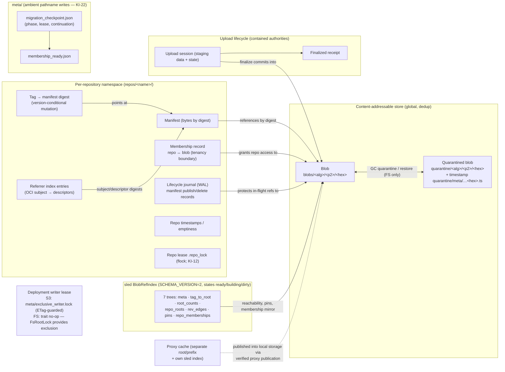

# Logical data model

- **Role:** the logical data entities, their relationships, and which component owns each. Derived from the audited implementation at `master` @ `2718bc16` (audit passes A/C; anchors in [`../outdated/audit/2026-09-19-doc-reconciliation-notes.md`](../outdated/audit/2026-09-19-doc-reconciliation-notes.md)).
- Physical key layouts shown are the FS layout; the S3 layout mirrors the same key families under the configured prefix (e.g. `blobs/sha256/…`, `repos/…`, `repo-memberships/by-repo/…`, writer lease at `meta/exclusive_writer.lock`).

## Ownership and consistency

| Entity | Owning component | Backend-neutral? | Consistency mechanism |
|---|---|---|---|
| Blobs (CAS) | upload coordinator (writes), read adapter (reads) | per-backend adapters; streaming top-K listing | atomic publish under contained authorities; pins protect in-flight content |
| Manifests | `manifest_domain` (Phase 4) | yes — `ObjectStore` | WAL lifecycle journal; publish/delete replayed or rolled back on startup |
| Tags | `tag_domain` (Phase 3) | yes | version-conditional mutation (CAS semantics; S3 ETag `If-Match`) |
| Referrers | `referrer_domain` (Phase 5) | yes | conditional updates within manifest lifecycle |
| Membership point ops | `membership_domain` (Phase 6) | yes | written before pin release during upload finalize; primary tenancy boundary |
| Membership enumeration | per-backend seam (`membership_read.rs`) | **no** (KI-24) | pinned-reader traversal |
| Lifecycle journal | `journal_domain` (Phase 7) | yes | durable writes (`8c0ac64`); active records block GC |
| Repo timestamps/emptiness | `repo_timestamp_domain` (Phase 8) | yes | FS uses contained existence probe (KI-23), S3 empty-is-absent |
| Upload sessions/receipts | `UploadAuthorities` (contained) | per-backend | session lock + `run_locked`; reaper enumerates via contained streams |
| Quarantine | GC (`blob_gc`) | FS only (S3 = direct conditional delete) | reads fall back LIVE→QUARANTINED; restore barrier on failure |
| `meta/` markers | `FsStorage` direct | per-backend | **ambient pathname** `atomic_write_file` (KI-22); reads contained |
| Ref-index trees | `BlobRefIndex` | n/a (sled, local) | destructive rebuild serialized via shared gate; heal-before-pin ordering |
| Writer lock / repo lease | mutation authority / `FsStorage` | per-backend | S3: ETag-guarded lease doc `meta/exclusive_writer.lock`; FS: storage-level lease is a no-op default (FsRootLock gives exclusion); repo-lease renew is a no-op (KI-12) |
| Proxy cache | `Proxy` + proxy storage port | per-backend | separate root prevents cache/local mixing; eviction FS-only (KI-02) |

Notes: the sled index is a **derived** structure — rebuildable from storage; correctness of deletion never rests on it alone (five-axis GC protection, [`README.md`](README.md) §5.2). Membership records, not CAS presence, are the tenancy boundary: a blob's existence in CAS grants no repository access.
