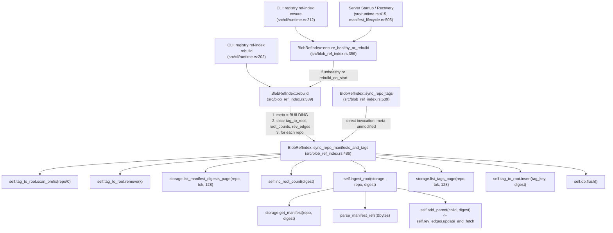

# Reference-Index Synchronization Hardening Architecture Design

- **Status**: DRAFT / READY FOR REVIEW
- **Date**: 2026-09-11
- **Author**: Antigravity Pair Programming
- **Scope**: Reference-index synchronization hardening (`BlobRefIndex::sync_repo_manifests_and_tags`) before production manifest-listing promotion.
- **Repository Baselines**:
  - `registry-rust`: `ea5cdaa4429f0ef265172ae10b4d9e112e0e1bc6`
  - `storage-layer-rust`: `0a628fd08232c3a5ce37c7a2d1d5f3ba2b2fe08e`
- **Canonical Quality Gates**: All open (O-03, O-04, O-05, O-06, O-13, O-15, O-16, D-06).

---

## 1. Executive Summary & Problem Framing

### 1.1 Context and Role of Reference Index
The OCI registry architecture utilizes `BlobRefIndex` (implemented via `sled` embedded key-value trees in `src/blob_ref_index.rs`) to track blob and manifest reachability graphs for online garbage collection, upload publication leases, and tag alias resolution.

In prior development slices, a contained manifest-listing test seam was integrated into the test harness, while production manifest listing and resource-limit configurations remain deferred. In the latest lifecycle commit, reference discovery was hardened in `manifest_lifecycle.rs` by changing `is_blob_referenced_in_repo` to return `Result<bool, StorageError>`, propagating discovery errors to all callers, and detecting repeated pagination tokens via `StorageError::backend(...)`.

During prior source review, structural vulnerabilities were identified in `BlobRefIndex::sync_repo_manifests_and_tags` (`src/blob_ref_index.rs:486–537`). This method is responsible for synchronizing a repository's manifest reachability roots and tag aliases from authoritative storage into the index. Current production code executes the following sequence:
1. **Eager Tag Deletion**: Immediately scans `tag_to_root` with prefix `repo\0` and calls `self.tag_to_root.remove(k)` for existing tags before initiating any manifest listing. Sled prefix scan errors are filtered out and deletion errors are ignored.
2. **Incremental Manifest Ingestion**: Paginates through `storage.list_manifest_digests_page`, immediately incrementing root counts in `root_counts` via `self.inc_root_count` and performing recursive DAG ingestion into `rev_edges` via `self.ingest_root` for each discovered manifest on each page.
3. **Incremental Tag Ingestion**: Paginates through `storage.list_tags_page`, writing discovered tag mappings into `tag_to_root`.
4. **Flush**: Flushes the sled database at the very end.

### 1.2 Identified Failure Modes in Current Code
1. **Destructive Partial Mutation on Discovery Failure**: If `storage.list_manifest_digests_page` fails (e.g. on page 1 due to storage I/O, or on page 2 due to network failure, unreadable continuation token, or pagination cycle), existing tags for the repository may have already been removed from `tag_to_root`. Because the error propagates immediately via `?`, tag re-insertion is never reached, leaving tag mappings missing from the index.
2. **Root Count Inflation Across Retries**: If manifest listing fails on a continuation page (e.g. page 2), manifests from page 1 have already had their root counts incremented via `self.inc_root_count`. Because `sync_repo_manifests_and_tags` contains no decrement or rollback logic, a subsequent retry restarts pagination from page 1 and calls `inc_root_count` again, incrementing root counts (from 1 to 2, then 3). This persists in the active index until a full `rebuild` clears `root_counts`.
3. **Health Markers Across Different Caller Boundaries**: When `sync_repo_manifests_and_tags` is called directly via `sync_repo_tags`, it does not touch `meta`. If the index was healthy (`META_STATE_READY`), `check_health()` continues to return `Ok(())` despite partial failure. Conversely, when invoked during `rebuild()`, `meta` is already set to `META_STATE_BUILDING` and all trees were cleared prior to calling synchronization.
4. **Unbounded Loops from Pagination Cycles**: Neither manifest pagination nor tag pagination tracks continuation tokens. If storage returns a cyclic continuation token (`tok_a -> tok_a` or `tok_a -> tok_b -> tok_a`), `sync_repo_manifests_and_tags` loops indefinitely, repeatedly performing storage reads.

---

## 2. Complete Source-Grounded Call Chain & Mechanics

### 2.1 Complete Call Hierarchy and Caller Boundaries



### 2.2 Verbatim Source Code Excerpts

#### Excerpt 1: `BlobRefIndex::sync_repo_manifests_and_tags` and `sync_repo_tags`
From `src/blob_ref_index.rs`, lines 486–545:
```rust
    pub async fn sync_repo_manifests_and_tags(
        &self,
        storage: &(impl crate::storage::BlobRefIndexStoragePort + ?Sized),
        repo: &str,
    ) -> Result<(), RefIndexError> {
        // 1. Remove all existing tags for this repo from the index.
        let prefix = tag_prefix(repo);
        let existing_tags: Vec<Vec<u8>> = self
            .tag_to_root
            .scan_prefix(prefix)
            .filter_map(|r| r.ok())
            .map(|(k, _v)| k.to_vec())
            .collect();
        for k in existing_tags {
            let _ = self.tag_to_root.remove(k);
        }

        // 2. Bounded pagination of ALL stored manifests in this repo (stored manifests are roots)
        let mut manifest_token: Option<String> = None;
        loop {
            let (manifests, next_tok) = storage
                .list_manifest_digests_page(repo, manifest_token.as_deref(), 128)
                .await?;
            for digest in manifests {
                self.inc_root_count(digest.as_str().as_bytes())?;
                self.ingest_root(storage, repo, &digest).await?;
            }
            match next_tok {
                Some(tok) => manifest_token = Some(tok),
                None => break,
            }
        }

        // 3. Bounded pagination of tags in this repo (tags map alias -> digest)
        let mut tag_token: Option<String> = None;
        loop {
            let (tags, next_tok) = storage
                .list_tags_page(repo, tag_token.as_deref(), 128)
                .await?;
            for (tag, digest) in tags {
                self.tag_to_root
                    .insert(tag_key(repo, &tag), digest.as_str().as_bytes())?;
            }
            match next_tok {
                Some(tok) => tag_token = Some(tok),
                None => break,
            }
        }

        self.db.flush()?;
        Ok(())
    }

    pub async fn sync_repo_tags(
        &self,
        storage: &(impl crate::storage::BlobRefIndexStoragePort + ?Sized),
        repo: &str,
    ) -> Result<(), RefIndexError> {
        self.sync_repo_manifests_and_tags(storage, repo).await
    }
```

#### Excerpt 2: `BlobRefIndex::rebuild`
From `src/blob_ref_index.rs`, lines 589–627:
```rust
    pub async fn rebuild(
        &self,
        storage: &(impl crate::storage::BlobRefIndexStoragePort + ?Sized),
    ) -> Result<(), RefIndexError> {
        self.meta
            .insert(META_SCHEMA_VERSION, encode_u32(SCHEMA_VERSION))?;
        self.meta.insert(META_STATE, META_STATE_BUILDING)?;
        self.db.flush()?;

        self.tag_to_root.clear()?;
        self.root_counts.clear()?;
        self.rev_edges.clear()?;
        self.repo_memberships.clear()?;

        let repos = storage.list_repositories().await?;
        for repo in &repos {
            self.sync_repo_manifests_and_tags(storage, repo).await?;
        }

        // Global bounded pagination over ALL repository blob memberships
        // (Ensures membership-only repositories with zero tags/manifests are fully indexed)
        let mut token: Option<String> = None;
        loop {
            let (page, next_tok) = storage
                .list_all_repo_blob_memberships_page(token.as_deref(), 256)
                .await?;
            for rec in page {
                self.record_membership(&rec.digest, rec.repo.as_str())?;
            }
            match next_tok {
                Some(tok) => token = Some(tok),
                None => break,
            }
        }

        self.meta.insert(META_STATE, META_STATE_READY)?;
        self.db.flush()?;
        Ok(())
    }
```

#### Excerpt 3: `BlobRefIndex::ingest_root`, `add_parent`, `inc_root_count`, `dec_root_count`
From `src/blob_ref_index.rs`, lines 683–781:
```rust
    async fn ingest_root(
        &self,
        storage: &(impl crate::storage::BlobRefIndexStoragePort + ?Sized),
        repo: &str,
        root: &Digest,
    ) -> Result<(), RefIndexError> {
        let mut queue: VecDeque<Digest> = VecDeque::new();
        queue.push_back(root.clone());

        let mut visited: HashSet<String> = HashSet::new();

        // Per-repo cache to avoid repeated manifest reads/parses.
        let mut refs_cache: HashMap<String, Option<crate::manifest_refs::ManifestRefs>> =
            HashMap::new();

        while let Some(digest) = queue.pop_front() {
            if !visited.insert(digest.hex().to_string()) {
                continue;
            }

            let digest_hex = digest.hex().to_string();
            let refs = if let Some(v) = refs_cache.get(&digest_hex) {
                match v.clone() {
                    Some(r) => r,
                    None => continue,
                }
            } else {
                let (_meta, bytes) = match storage.get_manifest(repo, &digest).await {
                    Ok(v) => v,
                    Err(StorageError::NotFound) => {
                        refs_cache.insert(digest_hex, None);
                        continue;
                    }
                    Err(e) => return Err(e.into()),
                };

                let parsed = parse_manifest_refs(&bytes)?;
                refs_cache.insert(digest_hex, Some(parsed.clone()));
                parsed
            };

            // child blob -> parent manifest
            for child_blob in refs.blob_references() {
                self.add_parent(child_blob.as_str().as_bytes(), digest.as_str().as_bytes())?;
            }

            // child manifest -> parent manifest
            for child_manifest in refs.manifest_references() {
                self.add_parent(
                    child_manifest.as_str().as_bytes(),
                    digest.as_str().as_bytes(),
                )?;
                queue.push_back(child_manifest.clone());
            }
        }

        Ok(())
    }

    fn add_parent(&self, child_key: &[u8], parent: &[u8]) -> Result<(), RefIndexError> {
        self.rev_edges.update_and_fetch(child_key, |old| {
            let mut parents: Vec<Vec<u8>> = match old {
                Some(v) => decode_parent_list_bytes(v).unwrap_or_default(),
                None => Vec::new(),
            };

            if parents.iter().any(|p| p.as_slice() == parent) {
                return Some(encode_parent_list_bytes(&parents));
            }

            parents.push(parent.to_vec());
            Some(encode_parent_list_bytes(&parents))
        })?;
        Ok(())
    }

    fn inc_root_count(&self, root: &[u8]) -> Result<(), RefIndexError> {
        self.root_counts.update_and_fetch(root, |old| {
            let cur = old.and_then(|v| decode_u64(v)).unwrap_or(0);
            Some(encode_u64(cur.saturating_add(1)))
        })?;
        Ok(())
    }

    fn dec_root_count(&self, root: &[u8]) -> Result<(), RefIndexError> {
        let updated = self.root_counts.update_and_fetch(root, |old| {
            let cur = old.and_then(|v| decode_u64(v)).unwrap_or(0);
            let next = cur.saturating_sub(1);
            if next == 0 {
                None
            } else {
                Some(encode_u64(next))
            }
        })?;

        // If updated == None, key was removed.
        let _ = updated;
        Ok(())
    }
```

#### Excerpt 4: Health Checking and Sled State Management
From `src/blob_ref_index.rs`, lines 271–349:
```rust
    pub fn check_health(&self) -> Result<(), RefIndexError> {
        let v = self
            .meta
            .get(META_SCHEMA_VERSION)?
            .ok_or_else(|| RefIndexError::Corrupt("missing schema_version".to_string()))?;
        let schema = decode_u32(&v)
            .ok_or_else(|| RefIndexError::Corrupt("invalid schema_version".to_string()))?;
        if schema != SCHEMA_VERSION {
            return Err(RefIndexError::Corrupt(format!(
                "unsupported schema_version={schema} (expected {SCHEMA_VERSION})"
            )));
        }

        let state = self
            .meta
            .get(META_STATE)?
            .ok_or_else(|| RefIndexError::Corrupt("missing state".to_string()))?;
        if state.as_ref() == META_STATE_DIRTY {
            return Err(RefIndexError::Corrupt(
                "index marked dirty (rebuild required)".to_string(),
            ));
        }
        if state.as_ref() != META_STATE_READY {
            return Err(RefIndexError::Corrupt(
                "index not ready (previous rebuild incomplete?)".to_string(),
            ));
        }

        // Light-weight sanity check: ensure at least one root_count entry (if any)
        // decodes as u64.
        if let Some(res) = self.root_counts.iter().next() {
            let (_k, v) = res?;
            if decode_u64(&v).is_none() {
                return Err(RefIndexError::Corrupt(
                    "invalid root_counts entry".to_string(),
                ));
            }
        }

        Ok(())
    }
```

#### Excerpt 5: Lifecycle Caller Recovery Excerpt
From `src/manifest_lifecycle.rs`, lines 503–520:
```rust
        if let Some(idx) = self.ref_index.as_ref() {
            if idx.check_health().is_err() {
                idx.ensure_healthy_or_rebuild(&self.storage, true, false)
                    .await?;
            }
        }
        Ok(())
    }

    pub async fn recover_pending_journal_under_lock(
        &self,
        repo: &str,
        journal: &LifecycleJournalRecord,
    ) -> Result<(), ManifestLifecycleError> {
        if let Some(idx) = self.ref_index.as_ref() {
            idx.mark_dirty()?;
        }
```

### 2.3 Identification of Caller Boundaries and Scope of Preservation
- **Direct Synchronization (`sync_repo_tags`)**:
  - `meta` is unmodified at entry. If the index was previously marked `READY`, readers see `READY`.
  - The tree structures contain existing tags, counts, and edges for the repository.
  - **Preservation Scope**: Function-entry state. If discovery fails, no mutations have been applied, and the index remains in its function-entry state.
- **Index Rebuild (`rebuild`)**:
  - `meta` is explicitly set to `META_STATE_BUILDING` and flushed.
  - `tag_to_root`, `root_counts`, `rev_edges`, and `repo_memberships` are cleared (`.clear()?`).
  - **Preservation Scope**: Scoped to the function-entry state of each `sync_repo_manifests_and_tags` call during the rebuild loop. A discovery failure does *not* restore the pre-rebuild index; the trees remain in their cleared/partially rebuilt state, and `meta` remains `BUILDING`. Readers calling `check_health()` observe `RefIndexError::Corrupt("index not ready (previous rebuild incomplete?)")`.
- **Lifecycle Recovery (`ensure_healthy_or_rebuild`)**:
  - If unhealthy, triggers `rebuild()`. During journal recovery, `idx.mark_dirty()?` is called, ensuring `check_health()` fails until rebuild finishes.

---

## 3. Comprehensive Failure-State Matrix

| Stage | Operation & Error Source | Prior Reads & Writes Performed | Error Propagation | Residual Index State | Reader Observation (`is_blob_referenced`, `check_health`) | Retry Semantics & Count Behavior | Authoritative Storage State |
| :--- | :--- | :--- | :--- | :--- | :--- | :--- | :--- |
| **Stage A: Tag Scan & Removal** | `tag_to_root.remove(k)` fails on sled error. | Reads: `tag_to_root.scan_prefix`. Writes: Partial deletion of tag keys in sled page cache. | Scan errors are dropped (`filter_map(|r| r.ok())`). Remove errors are ignored (`let _ = ...`). | Some tags for `repo` may be removed while others remain. `meta` is whatever it was at entry (`READY` or `BUILDING`). | Readers may observe partially missing tags. `check_health()` returns `Ok(())` if state was `READY`. | Retry re-scans remaining tags and attempts removal. | Authoritative storage untouched. |
| **Stage B: Manifest Listing (Page 1)** | `storage.list_manifest_digests_page(repo, None, 128)` fails (e.g. storage I/O, network partition, permission). | Reads: Tag prefix scan; storage listing attempt. Writes: Tags matching scan were removed from `tag_to_root`. | `?` propagates `StorageError` converted into `RefIndexError::Storage`. | Existing tags matching prefix have been removed. `root_counts` and `rev_edges` untouched for this run. | Tag readers find tags missing. If called directly, `check_health()` returns `Ok(())`. Missing tags do not prove blobs are unreferenced, as other tags, manifests, or memberships may protect them. | **Count Inflation Deferred**: If retried successfully later, manifest root counts will be incremented. Between failure and retry, tags remain missing. | Authoritative storage untouched. |
| **Stage C: Manifest Listing (Page N > 1)** | `storage.list_manifest_digests_page(repo, Some(tok), 128)` fails on continuation page (e.g. token error, I/O, cycle). | Reads: Pages 1..N-1 listed and manifests read. Writes: Tags removed; `root_counts` incremented for manifests on pages 1..N-1; `rev_edges` written for pages 1..N-1. | `?` propagates error immediately. | Partial manifests recorded. Tags removed. `root_counts` contains increments for pages 1..N-1. | `check_health()` returns `Ok(())` (if `READY`). Missing reverse edges from unindexed manifests may prevent discovering paths through them. | **Count Accumulation**: On retry, pages 1..N-1 manifests are listed again and `inc_root_count` increments them a second time. Counts accumulate in the active index until a full `rebuild` clears `root_counts`. | Authoritative storage untouched. |
| **Stage D: Manifest Ingestion (`ingest_root`)** | `get_manifest` returns non-404 error, or `parse_manifest_refs` fails. | Reads: Manifest listed. Writes: `inc_root_count` already called for current digest; tags removed; partial `rev_edges`. | `?` propagates error immediately (`Storage` or `ManifestParse`). | Manifest is in `root_counts`, but its child edges in `rev_edges` are incomplete or missing. | `is_blob_referenced` sees root in `root_counts`, but cannot traverse through missing edges. Other paths may still protect blobs. | On retry, manifest has `inc_root_count` called again. | Authoritative storage untouched. |
| **Stage E: Tag Listing (Page 1 or N > 1)** | `storage.list_tags_page` fails (I/O, network, token cycle). | Reads: Manifests listed and ingested. Writes: All manifests in `root_counts` and `rev_edges`. `tag_to_root` has 0 or partial tags. | `?` propagates error immediately. | Manifests ingested; tags missing or partial. | Tag aliases incomplete. `check_health()` returns `Ok(())` (if `READY`). | On retry, existing tags removed, all manifests re-enumerated, and root counts incremented again. | Authoritative storage untouched. |
| **Stage F: Sled Database Flush** | `self.db.flush()` fails (e.g. disk full, ENOSPC, I/O error). | Reads: All storage reads completed. Writes: All tree mutations buffered in sled page cache. | `?` propagates `RefIndexError::Sled`. | Sled WAL not durably synced. In-memory page cache contains mutations, but durability is not guaranteed. | Readers in-process see updated memory cache; restart behavior depends on sled WAL integrity. Application and flush failures remain outside the discovery-preservation guarantee. | Flush retry depends on external disk condition. | Authoritative storage untouched. |

---

## 4. Evaluation and Comparison of Mitigation Approaches

```mermaid
graph TD
    subgraph Current Sequence
        A1[1. Delete Existing Tags] --> A2[2. For each manifest page: Inc Root & Ingest I/O]
        A2 --> A3[3. For each tag page: Insert Tag]
        A3 --> A4[4. Flush DB]
        A2 -.->|Error on Page 2| F1[FAIL: Tags Missing, Page 1 Counts Incremented]
    end

    subgraph Proposed: Pre-Mutation Discovery Staging
        B1[1. Enumerate Manifests & Detect Cycles] --> B2[2. Fetch & Parse DAG in Memory]
        B2 --> B3[3. Enumerate Tags & Detect Cycles]
        B3 --> B4{All Discovery OK?}
        B4 -->|Error| B5[ABORT: ZERO Index Writes, Function-Entry State Preserved]
        B4 -->|Success| B6[4. Apply Staged Mutations to Sled Trees (No I/O)]
        B6 --> B7[5. Flush DB]
    end
```

### 4.1 Approach Evaluation

#### Approach 1: Pre-Mutation Discovery Collection & Staging (Recommended)
- **Concept**: Split synchronization into two strict phases:
  1. *Observation Phase (Read-Only Storage Discovery)*: Discover all manifest roots, fetch and parse manifest payloads, accumulate recursive DAG edges, and discover all tags into an in-memory structure before performing any mutation to sled trees.
  2. *Application Phase (Index Mutation)*: Only after all storage enumeration and parsing succeed, apply mutations to `tag_to_root`, `root_counts`, and `rev_edges`. The application phase does not perform any storage I/O.
- **Memory Consumption**:
  - Memory consumption depends directly on the number of roots, recursive child edges, tags, repository/tag name lengths, and collection bookkeeping overhead.
  - Memory remains **unbounded in this proposed slice**, as resource limits and page-count caps are explicitly deferred.
- **Concurrency & Snapshot Characteristics**:
  - Staging observations in memory does **not** provide snapshot isolation, atomic application across sled trees, or external storage consistency. Authoritative storage can change concurrently.
  - What it guarantees is that discovery errors abort before any sled tree is touched, preserving the index in its function-entry state.
- **Crash & Retry Characteristics**:
  - If discovery fails, zero sled mutations have occurred; retrying from the same initial state does not cause count accumulation from the failed attempt.
  - However, successful application continues to invoke `inc_root_count` as in existing code. True synchronization idempotence across multiple successful runs is explicitly deferred.

#### Approach 2: Sled Multi-Tree Transactions (`sled::transaction`) (Rejected)
- **Reason**: Sled transaction closures are strictly synchronous: `Fn(&TransactionalTree) -> ...`. Storage operations (`list_manifest_digests_page.await`, `get_manifest.await`, `list_tags_page.await`) cannot be executed inside a sled transaction closure. Sled transactions could only apply to Phase 2 (application), not discovery.

#### Approach 3: Generation / Replacement Trees (Rejected)
- **Reason**: `root_counts` and `rev_edges` are global structures across all repositories, not partitioned per repository. Swapping trees for a single repository would sever cross-repo DAG reachability. Sled does not support atomic tree aliasing.

### 4.2 Token Opacity, Cycles, and Bounding
- **Opaque Continuation Tokens**: Continuation tokens returned by `list_manifest_digests_page` and `list_tags_page` must be treated as opaque strings without assumptions regarding ordering, structure, or encoding.
- **Independent Cycle Detection**:
  - Manifest pagination: tracks `seen_manifest_tokens: HashSet<String>`. If `next_tok` has already been observed, returns:
    ```rust
    Err(StorageError::backend(format!(
        "pagination cycle detected on continuation token '{next}' in repository '{repo}'"
    )).into())
    ```
  - Tag pagination: tracks `seen_tag_tokens: HashSet<String>`. If `next_tok` has already been observed, returns the corresponding backend error.
  - Cycle detection terminates both immediate cycles (`tok_a -> tok_a`) and multi-token cycles (`tok_a -> tok_b -> tok_a`).
- **Cycle Detection vs. Endless Sequence Bounding**:
  - Cycle detection identifies repeating tokens. It does not bound an endless sequence of distinct continuation tokens from a buggy or non-compliant backend. Distinct-token bounding is deferred to future resource-limit configuration slices.

---

## 5. Recommended Concrete Next Implementation Slice

### 5.1 Slice Specification
**Title**: Pre-Mutation Discovery Staging and Token Cycle Detection for `sync_repo_manifests_and_tags`

### 5.2 Precise Guarantees
1. **Function-Entry State Preservation on Discovery Failure**: If any error occurs during manifest pagination, manifest retrieval, manifest parsing, tag pagination, or continuation token validation, `sync_repo_manifests_and_tags` aborts immediately with **zero modifications** applied to `tag_to_root`, `root_counts`, or `rev_edges`.
2. **Read-Only Discovery Result Definition**:
   ```rust
   struct DiscoveredRepoData {
       roots: Vec<Digest>,
       // Complete observed recursive edges: (child_digest_bytes, parent_digest_bytes)
       edges: Vec<(Vec<u8>, Vec<u8>)>,
       // Discovered tags: (tag_key_bytes, digest_bytes)
       tags: Vec<(Vec<u8>, Vec<u8>)>,
   }
   ```
3. **No I/O During Application**: Application iterates strictly over `DiscoveredRepoData` and modifies sled trees. It does not call `ingest_root` or perform any storage I/O after mutations begin.
4. **Tolerated `NotFound` Manifest Semantics Preserved**: If `storage.get_manifest` returns `StorageError::NotFound` during recursive discovery, it is skipped and cached as absent, matching the existing behavior of `ingest_root` (lines 712–715). Real I/O errors and parse errors propagate and abort discovery.
5. **Token Cycle Detection**: Both manifest and tag pagination detect repeated continuation tokens using `HashSet<String>` and return `StorageError::backend(...)`.

### 5.3 Explicitly Deferred Work
- **Successful-Sync Root Count Idempotence**: In current code, repeated *successful* calls to `sync_repo_manifests_and_tags` increment root counts for discovered roots on each run. Resolving this requires tracking per-repository root provenance or reference reconciliation, because `root_counts` is a global table shared across repositories (a manifest in `repo1` and `repo2` legitimately has count 2). Modifying global root count accounting is deferred.
- **Resource-Limit and Pagination Bounding**: Configurable limits on page sizes and maximum page counts remain deferred.
- **Production Manifest-Listing Promotion**: Promoting the production manifest-listing engine from the contained test seam remains deferred.

### 5.4 Exact Target Files
- `registry-rust/src/blob_ref_index.rs`: Refactor `sync_repo_manifests_and_tags` into discovery collection, recursive edge traversal, token cycle detection, and application phases; add unit tests.
- Zero changes to `storage-layer-rust`, public interfaces, Cargo dependencies, or persisted schema (`SCHEMA_VERSION = 1`).

---

## 6. Comprehensive Test Plan

All test commands derived from the repository layout are marked as **PLANNED — NOT EXECUTED**.

### 6.1 Planned Test Scenarios

#### Scenario 1: Manifest Listing Failure on First Page
- **Preconditions**: Repository contains 3 existing tags (`t1`, `t2`, `t3`) pointing to manifests `m1`, `m2`. Sled index contains these tags in `tag_to_root`.
- **Fault Injection**: `MockStorage` configured to return `Err(StorageError::Io("simulated disk error"))` on the initial call to `list_manifest_digests_page`.
- **Action**: Call `idx.sync_repo_manifests_and_tags(&storage, repo).await`.
- **Observable Invariants**:
  1. Returns `Err(RefIndexError::Storage(_))`.
  2. All 3 tags remain in `tag_to_root` with unmodified target digests.
  3. `root_counts` for `m1` and `m2` remain unchanged.

#### Scenario 2: Manifest Listing Failure on Continuation Page
- **Preconditions**: Repository contains manifests across 2 pages (page 1: `m1`, `m2`, `token="page2"`; page 2 fails).
- **Fault Injection**: Page 1 succeeds; page 2 returns `Err(StorageError::Io("network timeout"))`.
- **Action**: Call `idx.sync_repo_manifests_and_tags(&storage, repo).await`.
- **Observable Invariants**:
  1. Returns `Err(RefIndexError::Storage(_))`.
  2. `root_counts` for `m1` and `m2` are NOT incremented.
  3. `rev_edges` contains no partial edges from page 1 manifests.
  4. Existing tags in `tag_to_root` remain intact.

#### Scenario 3: Manifest Read / Parse Failure During Ingestion
- **Preconditions**: Manifest listing succeeds, returning manifest `m_corrupt`.
- **Fault Injection**: `storage.get_manifest(repo, &m_corrupt)` returns invalid JSON or truncated bytes causing `parse_manifest_refs` to fail with `ManifestParseError`.
- **Action**: Call `idx.sync_repo_manifests_and_tags(&storage, repo).await`.
- **Observable Invariants**:
  1. Returns `Err(RefIndexError::ManifestParse(_))`.
  2. `m_corrupt` is NOT added to `root_counts`.
  3. No partial reverse edges are inserted into `rev_edges`.
  4. Pre-existing index state is preserved.

#### Scenario 4: Manifest NotFound Tolerated During Recursive Ingestion
- **Preconditions**: Manifest `m1` references child manifest `m_missing`, which returns `StorageError::NotFound` on `get_manifest`.
- **Action**: Call `idx.sync_repo_manifests_and_tags(&storage, repo).await`.
- **Observable Invariants**:
  1. Returns `Ok(())`.
  2. `m1` is recorded as a root in `root_counts`.
  3. Child blob references of `m1` are present in `rev_edges`.
  4. `m_missing` is skipped without failing synchronization.

#### Scenario 5: Tag Listing Failure After Manifest Discovery
- **Preconditions**: Manifest listing and manifest reads succeed completely. Existing tags exist in `tag_to_root`.
- **Fault Injection**: `storage.list_tags_page(repo, None, 128)` returns `Err(StorageError::Io("tag directory unreadable"))`.
- **Action**: Call `idx.sync_repo_manifests_and_tags(&storage, repo).await`.
- **Observable Invariants**:
  1. Returns `Err(RefIndexError::Storage(_))`.
  2. ZERO manifests have root counts incremented.
  3. Existing tags in `tag_to_root` are NOT removed.

#### Scenario 6: Immediate and Multi-Token Pagination Cycles
- **Fault Injections**:
  - Test 6A: `list_manifest_digests_page` returns `tok_1 -> tok_1`.
  - Test 6B: `list_manifest_digests_page` returns `tok_1 -> tok_2 -> tok_1`.
  - Test 6C: `list_tags_page` returns `tag_tok_1 -> tag_tok_1`.
- **Action**: Call `idx.sync_repo_manifests_and_tags(&storage, repo).await`.
- **Observable Invariants**:
  1. Returns `Err(RefIndexError::Storage(StorageError::Backend(_)))` with message containing `"pagination cycle detected"`.
  2. Zero sled tree mutations occur; function-entry state preserved.

#### Scenario 7: Characterization of Existing Successful-Sync Count Behavior
- **Preconditions**: Repository with 2 manifests and 2 tags in storage.
- **Action**:
  1. Run `sync_repo_manifests_and_tags` once -> verify `Ok(())`, observe root count = 1.
  2. Run `sync_repo_manifests_and_tags` a second time -> verify `Ok(())`, observe root count = 2.
- **Observable Invariants**:
  1. Documents existing behavior: each successful run increments root counts for discovered roots.
  2. Confirms this slice does not alter successful-application semantics.

#### Scenario 8: Failure Followed by Success Parity
- **Preconditions**: Repository with manifests and tags. Initial index state $S_0$.
- **Action**:
  - Path A: From $S_0$, run successful `sync_repo_manifests_and_tags` -> yields state $S_A$.
  - Path B: From $S_0$, run `sync_repo_manifests_and_tags` with injected discovery failure (aborts), clear failure, run successful `sync_repo_manifests_and_tags` -> yields state $S_B$.
- **Observable Invariants**:
  1. $S_B$ is identical to $S_A$ in `tag_to_root`, `root_counts`, and `rev_edges`.
  2. Demonstrates that an intervening failed discovery leaves zero residual count inflation or missing tags.

### 6.2 Planned Verification Commands
```bash
# PLANNED — NOT EXECUTED: Run targeted ref-index unit tests
cargo test --locked --lib blob_ref_index::tests::test_sync_repo_ -- --nocapture

# PLANNED — NOT EXECUTED: Run full ref-index test suite
cargo test --locked --lib blob_ref_index -- --nocapture

# PLANNED — NOT EXECUTED: Run manifest lifecycle integration tests
cargo test --locked --test manifest_lifecycle_tests -- --nocapture
```

---

## 7. Status of Canonical Quality Gates

All canonical quality gates remain explicitly **OPEN**:
- **O-03**: Key and continuation-token contracts.
- **O-04**: Filesystem write durability and containment.
- **O-05**: Broader filesystem read containment.
- **O-06**: Typed AWS mapping and pinned-MinIO evidence.
- **O-13**: Hosting, distribution, and release strategy.
- **O-15**: Non-Linux verification.
- **O-16**: Earlier Slice 11 audit/test-inventory evidence.
- **D-06**: Broader extraction, cutover, compatibility, and distribution acceptance.
