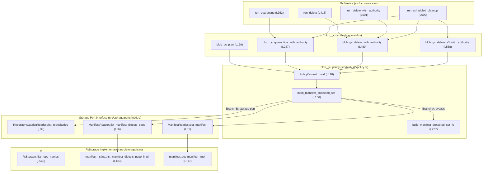

> **Historical snapshot — dated banner added 2026-09-19 (documentation reconciliation at `master` `2718bc16`).**
> Status stamps ("NOT COMMITTED", "PRODUCTION UNCHANGED", "DESIGN ONLY", pending-decision rows) and remaining-work lists below reflect authoring time, not the current tree. Contained GC manifest discovery landed (`2fc21aa`). A corrected successor design exists: filesystem-gc-contained-discovery-production-integration-design.md.
> Current state: [current-state.md](current-state.md) · Gates: [acceptance-gates.md](../../technical-debt.md) · Issues: [../known-issues.md](../../technical-debt.md) · Requirements: [../requirements.md](../../requirements.md)

# Filesystem GC Manifest Discovery Integration Design

## Status
- **Date**: 2026-09-12
- **State**: Design Proposal — Unapproved — Production Code Unchanged — Not Committed
- **Target Subsystem**: Garbage Collection Manifest Reachability Discovery (`src/blob_gc/policy.rs`, `src/storage/fs.rs`)
- **Preceding Milestone**: Filesystem GC Manifest Discovery Characterization Committed (`bfbcfc1d35ea12e96dcf5347cf0c4667a490b3b3`)

---

## 1. Exact Call-Chain and Ownership Map

### 1.1 Top-Level GC Callers & Execution Flow
Garbage collection is orchestrated by `GcService` (`src/gc_service.rs`) and executed through four primary entry points in `src/blob_gc/mod.rs`:



#### Consumer Trace and Scope of Mutation Halts
1. **`blob_gc_plan` (`src/blob_gc/mod.rs:129-150`)**:
   - `PolicyContext::build` is called at the start of planning before candidate traversal.
   - A discovery error returns `Err(BlobGcError::Policy(err))`, aborting planning immediately. Planning is read-only; zero mutations occur.
2. **`blob_gc_quarantine_with_authority` (`src/blob_gc/mod.rs:247-295`)**:
   - `PolicyContext::build` is invoked **inside the candidate loop** under the revalidation lock:
     ```rust
     let _reval_guard = consistency.acquire_gc_revalidation().await;
     let mut policy_ctx = PolicyContext::build(cfg, storage, idx, policy).await?;
     ```
   - Preceding operations for candidate $N$: Candidate age eligibility is checked (`check_candidate_age`), candidate counters are incremented, authority status is validated (`authority.is_active()`), and `authority.gc_mutation_permit()` is acquired.
   - **Mutation Scope**: Candidates $1 \dots (N-1)$ from earlier iterations may have **already been quarantined in storage**. A discovery error on candidate $N$ drops `_reval_guard` and halts subsequent quarantine operations, returning `Err(BlobGcError::Policy(err))`. It **does not undo** prior quarantine operations.
3. **`blob_gc_delete_with_authority` (`src/blob_gc/mod.rs:480-532`)**:
   - `PolicyContext::build` is invoked **inside the quarantine candidate loop** under the revalidation lock:
     ```rust
     let reval_guard = consistency.acquire_gc_revalidation().await;
     let mut policy_ctx = PolicyContext::build(cfg, storage, idx, policy).await?;
     ```
   - Preceding operations: If a candidate lacks a quarantine timestamp, `write_quarantine_time(cfg, &digest, now).await` **writes a metadata timestamp file to disk** before policy evaluation. Quarantine aging and authority permits are validated.
   - **Mutation Scope**: Candidates from earlier iterations may have **already been deleted from disk or restored to CAS**. A discovery error on candidate $N$ drops `reval_guard` and halts subsequent deletions, returning `Err(BlobGcError::Policy(err))`. It **does not undo** prior deletions, restorations, or quarantine timestamp writes.
4. **`blob_gc_delete_s3_with_authority` (`src/blob_gc/mod.rs:588-648`)**:
   - Invoked when `storage.gc_strategy() == GcStorageStrategy::S3DirectConditional`.
   - `PolicyContext::build` is called inside the candidate loop under `reval_guard`.

---

### 1.2 Actual Storage-Port Implementation in `src/blob_gc/policy.rs`
The actual production implementation of `build_manifest_protected_set` (`src/blob_gc/policy.rs:166-225`) is:

```rust
// File: src/blob_gc/policy.rs, lines 166-225
pub async fn build_manifest_protected_set(
    cfg: &crate::config::Config,
    storage: &(impl storage::GcServiceStoragePort + ?Sized),
) -> Result<HashSet<String>, GcPolicyError> {
    if storage.kind() == "fs"
        && tokio::fs::metadata(&cfg.fs_root.join("repos"))
            .await
            .is_ok()
    {
        return build_manifest_protected_set_fs(&cfg.fs_root).await;
    }

    let repos = storage
        .list_repositories()
        .await
        .map_err(GcPolicyError::ListRepositories)?;

    let mut protected = HashSet::new();
    for repo in repos {
        let mut cursor = None;
        loop {
            let (digests, next_cursor) = storage
                .list_manifest_digests_page(&repo, cursor.as_deref(), 100)
                .await
                .map_err(|source| GcPolicyError::ListManifests {
                    repository: repo.clone(),
                    source,
                })?;

            for digest in digests {
                protected.insert(digest.as_str().to_string());
                let (_meta, bytes) =
                    storage
                        .get_manifest(&repo, &digest)
                        .await
                        .map_err(|source| GcPolicyError::ReadManifest {
                            repository: repo.clone(),
                            digest: digest.to_string(),
                            source,
                        })?;
                let refs =
                    parse_manifest_refs(&bytes).map_err(|source| GcPolicyError::ParseManifest {
                        repository: repo.clone(),
                        digest: digest.to_string(),
                        source,
                    })?;
                for r in refs.all_references() {
                    protected.insert(r.as_str().to_string());
                }
            }

            if next_cursor.is_none() {
                break;
            }
            cursor = next_cursor;
        }
    }

    Ok(protected)
}
```

#### Key API Observations:
1. **Port Trait Names**: `storage.list_repositories()` is defined on `RepositoryCatalogReader` (`src/storage/ports/mod.rs:38-41`). `list_manifest_digests_page` and `get_manifest` are defined on `ManifestReader` (`src/storage/ports/mod.rs:43-62`). Both are supertraits of `GcServiceStoragePort` (`src/storage/ports/mod.rs:356-375`).
2. **Page Signature**: `storage.list_manifest_digests_page(&repo, cursor.as_deref(), 100)` returns `Result<(Vec<Digest>, Option<String>), StorageError>`.
3. **Manifest Read Signature**: `storage.get_manifest(&repo, &digest)` returns `Result<(ManifestMeta, bytes::Bytes), StorageError>`.
4. **Strict Error Propagation**: `get_manifest` errors propagate via `?` as `GcPolicyError::ReadManifest`. There is **no** `NotFound` skip in the current code; any read failure aborts protected-set construction immediately.
5. **Digest Representation**: Digests are collected into `protected` using `digest.as_str().to_string()`.

---

### 1.3 Scope of `BlobRefIndex` Reachability Safeguards

> [!IMPORTANT]
> **`BlobRefIndex` reachability protection is NOT limited to tagged manifests.**
> In the actual index synchronization implementation (`BlobRefIndex::sync_repo_manifests_and_tags`, `src/blob_ref_index.rs:493-531`, and `discover_repo_manifests_and_tags`, `src/blob_ref_index.rs:533-570`), the index enumerates all stored manifests via `storage.list_manifest_digests_page`. Every valid manifest discovered—whether tagged or untagged—is ingested into `idx.root_counts` via `inc_root_count` (lines 517–519), and its referenced config and layer blobs are registered as reverse DAG edges via `add_parent` (lines 520–522).
>
> Therefore, an untagged manifest may already protect its referenced blobs through `policy_ctx.is_referenced(&candidate.digest)` via sled DAG roots, independent of whether it was discovered by `build_manifest_protected_set`.

---

## 2. Repository-Discovery Contract

### 2.1 Current Implementation: `FsStorage::list_repo_names`

```rust
// File: src/storage/fs.rs, lines 566-641
    async fn list_repo_names(&self) -> Result<Vec<String>, StorageError> {
        let repos_root = self.root.join("repos");
        let mut repos = Vec::new();

        let mut stack: Vec<(PathBuf, String)> = vec![(repos_root.clone(), String::new())];
        while let Some((dir_path, rel)) = stack.pop() {
            let mut dir = match tokio::fs::read_dir(&dir_path).await {
                Ok(d) => d,
                Err(err) if err.kind() == std::io::ErrorKind::NotFound => continue,
                Err(err) => return Err(StorageError::io(err.to_string())),
            };

            while let Ok(Some(entry)) = dir.next_entry().await {
                let file_type = match entry.file_type().await {
                    Ok(t) => t,
                    Err(_) => continue,
                };
                if !file_type.is_dir() {
                    continue;
                }

                let name = match entry.file_name().to_str() {
                    Some(s) => s.to_string(),
                    None => continue,
                };

                // Do not descend into internal leaf dirs.
                if name == "tags"
                    || name == "manifests"
                    || name == "referrers"
                    || name == "blobs"
                    || name == "meta"
                {
                    continue;
                }

                let child_path = entry.path();
                let child_rel = if rel.is_empty() {
                    name
                } else {
                    format!("{rel}/{name}")
                };

                // Consider this a repo if it has tags/, manifests/, blobs/, or meta/ directories.
                let tags_dir = child_path.join("tags");
                let manifests_dir = child_path.join("manifests");
                let blobs_dir = child_path.join("blobs");
                let meta_dir = child_path.join("meta");
                let has_tags = tokio::fs::metadata(&tags_dir)
                    .await
                    .map(|m| m.is_dir())
                    .unwrap_or(false);
                let has_manifests = tokio::fs::metadata(&manifests_dir)
                    .await
                    .map(|m| m.is_dir())
                    .unwrap_or(false);
                let has_blobs = tokio::fs::metadata(&blobs_dir)
                    .await
                    .map(|m| m.is_dir())
                    .unwrap_or(false);
                let has_meta = tokio::fs::metadata(&meta_dir)
                    .await
                    .map(|m| m.is_dir())
                    .unwrap_or(false);
                if has_tags || has_manifests || has_blobs || has_meta {
                    repos.push(child_rel.clone());
                }

                stack.push((child_path, child_rel));
            }
        }

        repos.sort();
        repos.dedup();
        Ok(repos)
    }
```

### 2.2 Comparison: Direct Walker vs. `list_repo_names`

| Dimension | Direct Walker (`build_manifest_protected_set_fs`) | Storage Port Walker (`FsStorage::list_repo_names`) | Compatibility / Discovered Set Impact |
| :--- | :--- | :--- | :--- |
| **Non-UTF-8 Directory Ancestors** | `path.file_name().and_then(\|s\| s.to_str()).unwrap_or("")`. If non-UTF-8, `name == "" != "manifests"`. **Pushes `path` to stack and descends!** | `match entry.file_name().to_str() { Some(s) => s.to_string(), None => continue }`. **Skips entry immediately (`continue`)!** | **Discovered set reduced:** Repositories nested beneath non-UTF-8 ancestor directories are discovered by the direct walker, but dropped by `list_repo_names`. |
| **Reserved Directory Names** | Only treats `"manifests"` specially. A repository containing segments named `meta`, `tags`, `referrers`, or `blobs` is traversed. | Excludes descending into directories named `tags`, `manifests`, `referrers`, `blobs`, `meta`. | **Discovered set reduced:** Any repository whose path contains a reserved leaf segment (e.g. `repos/meta/repo`) is skipped by `list_repo_names`. |
| **Root-Adjacent Manifests** | Pushes `repos_root` to stack. If `repos/manifests` exists, matches `name == "manifests"` and scans manifests. | When child name is `"manifests"`, skips it (`continue`). `manifest_dir_key("")` rejects empty repo string. | **Discovered set reduced:** Manifests stored directly in `repos/manifests` are discovered by the direct walker, but cannot be addressed via `list_repo_names`. |
| **Symlink Handling on Entries** | `ent.file_type().await` reports `ft.is_dir() == false` for directory symlinks; skipped. | `entry.file_type().await` reports `file_type.is_dir() == false` for directory symlinks; skipped. | Parity on entry enumeration. |
| **Symlink Following on Leaf Probes** | Does not perform leaf probes; traverses into subdirectories directly. | `tokio::fs::metadata(&tags_dir)` **follows symlinks**. If `tags/` is a symlink to an external directory, `is_dir()` is true! | Divergence: `list_repo_names` recognizes a repository if its `tags/` or `manifests/` directory is a symlink to an external directory. |
| **Missing Paths** | `tokio::fs::read_dir` returning `NotFound` is silently ignored (`continue`). | `tokio::fs::read_dir` returning `NotFound` is silently ignored (`continue`). | Identical behavior. |
| **Iteration Errors** | `while let Ok(Some(ent)) = rd.next_entry().await` silently terminates on `Err`. | `while let Ok(Some(entry)) = dir.next_entry().await` silently terminates on `Err`. | Both currently drop remaining entries on transient iteration errors without failing closed. |
| **Invalid Repository Strings** | Accumulates digests into `HashSet` without validating repository naming rules. | If `list_repo_names` returns an invalid string, downstream `manifest_dir_key` returns `StorageError::InvalidRepoName`. In `build_manifest_protected_set`, this propagates via `?` as `GcPolicyError::ListManifests`. | **Aborts discovery immediately:** Invalid repository strings do not produce a silent reduced set; they fail closed with `ListManifests`. |

---

## 3. Integration Alternatives

### 3.1 Alternative A: Immediate Port Cutover (Intermediate Limitation)
Remove `build_manifest_protected_set_fs` and the `storage.kind() == "fs"` bypass in `src/blob_gc/policy.rs`. Route all `BlobGcPolicy::ManifestRooted` runs through `storage.list_repositories()`.

#### Exact Scope of Changes in Alternative A:
1. Delete `build_manifest_protected_set_fs` (`src/blob_gc/policy.rs:227-285`).
2. Remove the bypass condition in `build_manifest_protected_set` (`src/blob_gc/policy.rs:170-176`).
3. Preserve the existing storage-port loop in `src/blob_gc/policy.rs:178-225` verbatim, including strict `?` error propagation for `get_manifest`.
4. **Deferred Pagination Cycle Detection**: The current `build_manifest_protected_set` loop has **no cycle detection**. If a continuation token repeats or cycles, it will loop indefinitely (unlike `sync_repo_manifests_and_tags` in `src/blob_ref_index.rs:544-550`, which tracks `seen_manifest_tokens`). Cycle detection is deferred to a separate follow-up hardening proposal with explicit token-history accounting, error mapping, and tests.
5. **Explicit Intermediate Limitation**: `FsStorage::list_repo_names` is retained unchanged. Repository enumeration remains uncontained and pathname-based, with existing iteration error suppression.
6. **Approval Status**: **UNAPPROVED**. Requires maintainer approval.

---

### 3.2 Alternative B: Contained Repository Discovery via Existing `enumerate_dir`
Instead of inventing a new recursive enumeration API in `storage-fs`, implement a registry-owned recursive repository discovery algorithm in `registry-rust` (`src/storage/fs/repository_discovery.rs`) using the existing single-directory `storage_fs::FsMetadataReader::enumerate_dir` API.

#### Architectural Evaluation:
1. **Existing Capability**: `FsMetadataReader::enumerate_dir` (`crates/storage-fs/src/reader.rs:291-312`) already supports descriptor-relative single-directory enumeration beneath `root_fd` with `openat2` containment flags (`RESOLVE_BENEATH | RESOLVE_NO_SYMLINKS | RESOLVE_NO_MAGICLINKS`).
2. **Registry-Owned Policy**: Repository naming rules, segment depth bounds, reserved directory exclusions (`tags`, `manifests`, etc.), and leaf recognition logic belong in `registry-rust`. Pushing recursive traversal into `storage-fs` would inappropriately couple domain-specific repository semantics to the domain-free storage layer.
3. **Tree Budgeting**: A registry-owned recursive walker can enforce:
   - Maximum hierarchy depth (`max_repo_depth`).
   - Maximum total visited directories (`max_visited_directories`).
   - Maximum discovered repository count (`max_repositories`).
4. **Approval Status**: **UNAPPROVED**. Requires separate architectural slice.

---

### 3.3 Proposed Read-Error Policy (No Relaxation)
In the existing storage-port loop (`src/blob_gc/policy.rs:197-205`), `storage.get_manifest(&repo, &digest)` propagates any error via `?` as `GcPolicyError::ReadManifest`.
- **Preserve Strict Fail-Closed**: No `NotFound` skip is introduced. If a manifest is listed but cannot be read, GC must abort rather than risk missing referenced layer blobs.
- Any relaxation (e.g. treating concurrent deletion as a skippable condition) would introduce race windows where partially unlinked or corrupted manifests are ignored, and must be submitted as a separate, explicitly unapproved decision.

---

## 4. Containment and Resource Design

### 4.1 Scope of Directory Limits vs. Whole-Walk Resource Accounting

> [!WARNING]
> **`DirEnumerationLimits` apply across an entire `enumerate_dir` call for a single directory, NOT across the whole repository walk.**
> `DirEnumerationLimits::new(max_entries, max_total_name_bytes)` (`crates/storage-fs/src/dir.rs:66-91`) are enforced by `account_entry` during `readdir` for a single directory descriptor. They bound individual directory enumeration results, not total memory across the walk, total work/directories visited, blocking I/O duration, or threadpool task exhaustion.

| Resource Dimension | Scope of Current Accounting | Real Overhead & Unbounded Gaps |
| :--- | :--- | :--- |
| **Manifest Listing Defaults** | `DEFAULT_MANIFEST_LISTING_MAX_ENTRIES = 10_000`<br>`DEFAULT_MANIFEST_LISTING_MAX_NAME_BYTES = 1_500_000`<br>(`src/storage/fs/manifest_listing.rs:45-48`) | Specific approved constants for manifest directory enumeration; distinct from generic `DirEnumerationLimits`. |
| **Repeated Full Scan & Sort** | In `list_manifest_digests_page_impl` (`src/storage/fs/manifest_listing.rs:183-251`), **every page request reads all entries into memory, parses all filenames, and performs `all_digests.sort_unstable()` and `dedup()` before slicing.** | CPU complexity is $O(N \log N)$ per pagination request. Memory complexity is in-place ($O(1)$ auxiliary for sorting), while retained storage is $O(N)$ heap memory for `Vec<DirEntry>` (storing `OsString` names) and `Vec<Digest>` (storing parsed digests). On large directories with repeated pagination calls, this full scan and sort repeats for every page. |
| **Buffered Manifest Reads** | `manifest::get_manifest_impl` (`src/storage/fs/manifest.rs:117-141`) executes `stream.read_to_end(&mut bytes).await`. | **There is no enforced read-size ceiling.** The entire manifest payload is fully buffered into heap memory (`bytes::Bytes`). |
| **Accumulated Memory (`protected`)** | `protected: HashSet<String>` in `build_manifest_protected_set` accumulates every manifest digest and every referenced blob digest across all repositories. | Unbounded heap growth on registries with hundreds of thousands of manifests. |
| **Repository Discovery Depth** | Unbounded recursion stack in `list_repo_names`. | Risk of deep directory hierarchy traversal on rogue filesystems. |

---

### 4.2 Containment Non-Guarantees and Mutation Semantics
- **No Mount or Hard-Link Isolation**: `RESOLVE_BENEATH` prevents path resolution from escaping above `root_fd`, but does not isolate child mounts attached beneath the root, nor does it detect or isolate hard links to external files.
- **No Snapshot Isolation**: Directory iteration via `readdir` / `getdents64` observes directory entries as they are yielded across iterative system calls; concurrent file additions or deletions across pagination calls may be partially observed or missed.
- **Pathname-Mutation Coherence**: Pinned `root_fd` protects against re-resolving the top-level root path, but does not prevent concurrent pathname-based modifications, unlinks, or renames to descendant directories.

---

## 5. Failure and Concurrency Semantics

### 5.1 Root-Opening and Pathname Divergence Semantics

#### A. Root Constructor Implementation
`FsMetadataReader::open` (`crates/storage-fs/src/reader.rs:128-163`) uses `libc::open` with `O_PATH` without issuing `openat2`:
```rust
// File: storage-layer-rust/crates/storage-fs/src/reader.rs, lines 139-144
let raw_fd = unsafe {
    libc::open(
        c_path.as_ptr(),
        libc::O_DIRECTORY | libc::O_PATH | libc::O_CLOEXEC,
    )
};
```
Capability probing and subsequent contained operations (like `enumerate_dir_async` and `open_payload`) are separate, subsequent lookups that issue `openat2` relative to `root_fd`.

#### B. Storage-Root Pathname Replacement vs. Descendant Replacement
1. **Rename/Replacement of the Storage-Root Pathname**:
   - If the storage-root pathname itself (e.g. `/var/lib/registry`) is renamed or replaced on the host filesystem:
     * Pathname-based discovery (`list_repo_names` concatenating `self.root.join("repos")`) will access the new storage-root path on the host.
     * The pinned reader (`FsMetadataReader`), however, holds `root_fd` attached to the inode of the original storage root directory. Contained lookups continue resolving beneath the original root inode.
2. **Replacement of `repos` Beneath the Same Storage Root**:
   - The pinned descriptor is the storage root (`root_fd`), **not** `repos/`.
   - Subsequent descriptor lookups (`enumerate_dir(Some(&dir_key), limits)`) issue a fresh `openat2` call relative to `root_fd` for each operation.
   - Therefore, fresh descendant lookups **can observe** a replaced `repos/` directory beneath that same storage root.
3. **Changes Between Enumeration and Subsequent Operations**:
   - In Alternative A, `storage.list_repositories()` delegates to `list_repo_names` (uncontained pathname walker), and subsequently `storage.list_manifest_digests_page` resolves `repos/<repo>/manifests` relative to `root_fd`.
   - If a repository or its `manifests/` directory disappears or is modified between `list_repo_names` and `list_manifest_digests_page`:
     * `list_manifest_digests_page_impl` encounters `FsDirError::NotFound` on `repos/<repo>/manifests`.
     * Line 197 (`src/storage/fs/manifest_listing.rs`) translates `FsDirError::NotFound` to an empty page (`Ok((Vec::new(), None))`).
     * **Result**: Under this specific race condition, the repository is silently omitted from `manifest_protected` **without returning an error**. This omission is possible under transient mutation timing, not an inevitable outcome.

---

### 5.2 Halting vs. Rollback
- An error during `PolicyContext::build` halts subsequent candidate processing for that GC cycle.
- It **does not undo** candidate quarantines, deletions, or quarantine timestamp metadata writes performed in earlier iterations.

---

## 6. Proposed Tests and Implementation Slices

### 6.1 Recommended Implementation Sequence
1. **Slice 1 (Next Proposed Slice — Characterization)**: Repository-Discovery Characterization Tests.
   - Characterize actual behavior of `FsStorage::list_repo_names` vs `build_manifest_protected_set_fs` in `src/storage/fs/tests.rs`.
   - Characterize discovery set differences, nested repository recognition, reserved leaf exclusions, non-UTF-8 ancestor skips, symlink probe following, and iteration error handling.
2. **Slice 2 (Follow-Up — Unapproved)**: Contained GC Manifest Listing Cutover (Alternative A).
   - Remove `build_manifest_protected_set_fs` from `src/blob_gc/policy.rs`.
   - Route `BlobGcPolicy::ManifestRooted` through `storage.list_repositories()`.
   - Production bypass removal remains **UNAPPROVED** pending assessment of discovery differences and failure behavior from Slice 1.
3. **Slice 3 (Follow-Up — Unapproved)**: Contained Registry-Owned Repository Discovery (Alternative B).
   - Implement descriptor-relative recursive repository discovery in `registry-rust` using `FsMetadataReader::enumerate_dir`.
   - Replace `list_repo_names` with the contained recursive discovery implementation.

---

### 6.2 Test Matrix

| Test Identifier | Category | Target Component | Specific Verification Objective | Platform / Permission Constraints |
| :--- | :--- | :--- | :--- | :--- |
| `test_repo_names_nested_recognition` | Characterization (Proposed) | `storage::fs::tests` | Verify deeply nested repositories (`a/b/c/manifests`) are recognized. | `#[cfg(target_os = "linux")]` |
| `test_repo_names_reserved_leaf_exclusion` | Characterization (Proposed) | `storage::fs::tests` | Verify directories named `tags`, `manifests`, `referrers`, `blobs`, `meta` are skipped. | `#[cfg(target_os = "linux")]` |
| `test_repo_names_non_utf8_ancestor_skipped` | Characterization (Proposed) | `storage::fs::tests` | Verify non-UTF-8 ancestor directory causes nested repositories to be skipped by `list_repo_names`. | `#[cfg(target_os = "linux")]` |
| `test_repo_names_symlink_probe_followed` | Characterization (Proposed) | `storage::fs::tests` | Verify `tokio::fs::metadata` follows symlinks for leaf directory recognition. | `#[cfg(target_os = "linux")]`, `#[cfg(unix)]` |
| `test_gc_manifest_discovery_sha512_parity` | Integration (Proposed) | `blob_gc::policy::tests` | Verify untagged SHA-512 manifests are discovered under storage-port path. | `#[cfg(target_os = "linux")]` |
| `test_gc_manifest_discovery_budget_exhaustion_fails_closed` | Integration (Proposed) | `blob_gc::policy::tests` | Verify exceeding `DirEnumerationLimits` in a repository's manifest dir fails closed with `ListManifests`. | `#[cfg(target_os = "linux")]` |
| `test_gc_quarantine_halts_on_discovery_error_without_prior_rollback` | Real GC Caller (Proposed) | `blob_gc::tests` | Verify discovery failure halts subsequent candidate quarantine while earlier quarantined candidates remain in quarantine. | `#[cfg(target_os = "linux")]` |
| `test_gc_delete_halts_on_discovery_error_without_prior_rollback` | Real GC Caller (Proposed) | `blob_gc::tests` | Verify discovery failure halts subsequent candidate deletion while earlier deleted candidates remain deleted. | `#[cfg(target_os = "linux")]` |

---

## 7. Decision Table

| Proposed Behavior Change | Current Behavior | Proposed Behavior | Rationale | Compatibility & Operational Impact | Approval Status |
| :--- | :--- | :--- | :--- | :--- | :--- |
| **1. Remove GC FS Bypass** | Bypasses storage port if `storage.kind() == "fs"` and `cfg.fs_root/repos` metadata succeeds. | Unconditionally route `BlobGcPolicy::ManifestRooted` through `storage.list_repositories()`. | Eliminates redundant walker; promotes manifest listing to contained descriptor reader. | Enforces manifest directory limits; gains SHA-512 discovery parity. Discovered set may be reduced for non-UTF-8 ancestors or reserved-name repos. | **UNAPPROVED** (Pending Slice 1 Assessment) |
| **2. Support SHA-512 Manifests in GC** | Direct walker silently skips 128-hex SHA-512 manifest filenames (`hex.len() != 64`). | Storage port discovers both 64-hex SHA-256 and 128-hex SHA-512 manifests. | Closes GC reachability blind spot for untagged SHA-512 manifests. | Referenced blobs now protected in `manifest_protected`. | **UNAPPROVED** (Requires Maintainer Approval) |
| **3. Enforce Manifest Directory Budgets** | Direct walker ignores enumeration limits and buffers unlimited entries. | Storage port enforces `DirEnumerationLimits` (10,000 entries, 1.5MB name bytes). | Protects against memory exhaustion and threadpool starvation. | Repositories with $>10,000$ manifests fail closed with `ListManifests`. | **UNAPPROVED** (Requires Maintainer Approval) |
| **4. Retain Pathname Repository Discovery (Intermediate)** | `list_repo_names` uses raw `tokio::fs::read_dir` on `self.root.join("repos")`. | Retain `list_repo_names` unchanged as an intermediate limitation in Alternative A. | Smallest justified sequence; avoids premature cross-crate churn. | Repository enumeration remains uncontained until Alternative B. | **UNAPPROVED** (Requires Maintainer Approval) |
| **5. Preserve Strict Read Error Propagation** | `get_manifest` errors propagate via `?` as `GcPolicyError::ReadManifest`. | Retain strict `?` propagation without `NotFound` skip. | Prevents silent reachability omissions if a listed manifest cannot be read. | Aborts GC run if manifest read fails. | **UNAPPROVED** (Requires Maintainer Approval) |
| **6. Registry-Owned Contained Tree Traversal** | `list_repo_names` is uncontained and pathname-based. | In Alternative B, implement contained recursive traversal in `registry-rust` using `enumerate_dir`. | Reuses existing `storage-fs` API; keeps repository naming policy in registry. | Full descriptor containment for repository discovery. | **UNAPPROVED** (Requires Maintainer Approval) |

---

## 8. Canonical Quality Gates (All Remain OPEN)

All eight canonical quality gates remain explicitly **OPEN**:
- **O-03**: Key and continuation-token contracts. (**OPEN**)
- **O-04**: Filesystem write durability and containment. (**OPEN**)
- **O-05**: Broader filesystem read containment. (**OPEN**)
- **O-06**: Typed AWS mapping and pinned-MinIO evidence. (**OPEN**)
- **O-13**: Hosting, distribution, and release strategy. (**OPEN**)
- **O-15**: Non-Linux verification. (**OPEN**)
- **O-16**: Earlier Slice 11 audit/test-inventory evidence. (**OPEN**)
- **D-06**: Broader extraction, cutover, compatibility, and distribution acceptance. (**OPEN**)
