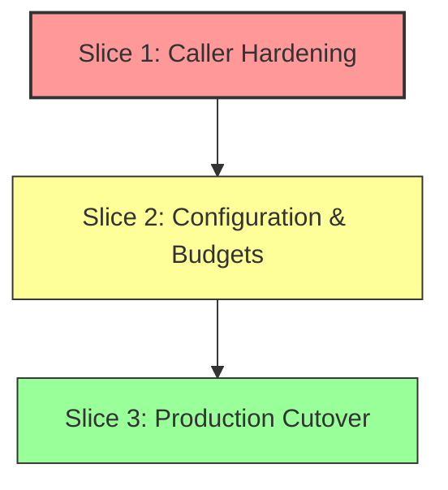

> **Historical snapshot — dated banner added 2026-09-19 (documentation reconciliation at `master` `2718bc16`).**
> Status stamps ("NOT COMMITTED", "PRODUCTION UNCHANGED", "DESIGN ONLY", pending-decision rows) and remaining-work lists below reflect authoring time, not the current tree. "Production promotion is blocked" was authoring-time; the promotion shipped (`f1d6d9c`, later `tag_domain` `32c42c6`). References `list_tag_files`, which no longer exists.
> Current state: [current-state.md](current-state.md) · Gates: [acceptance-gates.md](../../technical-debt.md) · Issues: [../known-issues.md](../../technical-debt.md) · Requirements: [../requirements.md](../../requirements.md)

# Production-Readiness Assessment: Contained Filesystem Tag Listing

**Document Status:** Architecture Assessment & Production Readiness Evaluation  
**Target Repository:** `registry-rust`  
**Storage Core Library:** `storage-layer-rust` (strictly read-only)  
**Status:** DRAFT — AWAITING CALLER HARDENING & PRODUCTION APPROVAL  
**Current Baseline Git Commits:**
- `registry-rust`: `8dd179987f00b0ec38500a4190ab3e3d4788673e`
- `storage-layer-rust`: `0a628fd08232c3a5ce37c7a2d1d5f3ba2b2fe08e`

---

## Executive Summary

The contained filesystem tag-listing test seam (`src/storage/fs/tag_listing.rs`) is locally committed and validated under `#[cfg(test)]`. It utilizes `FsMetadataReader` and Linux `openat2` resolution restrictions (`RESOLVE_BENEATH | RESOLVE_NO_SYMLINKS | RESOLVE_NO_MAGICLINKS`), tags-first enumeration with conditional repository probing, regular-file filtering, safe lexical cursor pagination with saturating arithmetic, and bounded directory/payload limits.

However, **production promotion is blocked**. An audit of production callers reveals that multiple critical lifecycle and migration paths suppress storage errors into empty tag discovery results. In particular, wildcard error handling in manifest lifecycle recovery and proxy eviction treats listing errors as proof of zero referencing tags, immediately triggering attempts to delete stored manifests and unlink proxy blob memberships.

Production cutover cannot safely occur until callers are hardened to distinguish clean `NotFound` conditions from storage/backend errors and fail closed. This document details the end-to-end caller traces, behavioral contracts, configuration architecture, scope boundaries, concrete prerequisites, and the required acceptance test suite for promotion.

---

## 1. Trace of Production Callers & Error Flow

A search across the repository identifies all consumers of `list_tags` and `list_tags_page`:

| Domain | Source File & Symbol | Invoked Method | Error Handling / Suppression Policy | Discovery Consequence | Destructive Hazard / Mutation Risk |
| :--- | :--- | :--- | :--- | :--- | :--- |
| **HTTP API / Catalog** | `src/http_api/catalog.rs`<br>`get_catalog` (lines 359–365) via `TagQueryService::list_tags` | `list_tags` | Suppresses `NotFound` to empty `Vec`; other errors fail closed with `?` | Clean empty repo -> empty tags; I/O error -> HTTP 500 | None (read-only query) |
| **Tag Query API** | `src/application/tags.rs`<br>`TagQueryService::query_tags` (lines 49) | `list_tags` | Maps errors via `?` to `TagQueryError`; `NotFound` becomes `404` | Discovery fails closed on backend/storage error | None (read-only query) |
| **Tag List API** | `src/application/tags.rs`<br>`TagQueryService::list_tags` (line 97) | `list_tags` | Maps errors via `?` to `TagQueryError`; `NotFound` becomes `404` | Discovery fails closed on backend/storage error | None (read-only query) |
| **Ref Index Sync** | `src/blob_ref_index.rs`<br>`sync_repo_manifests_and_tags` (lines 634) | `list_tags_page` | Phase 1 fail-closed via `?`; aborts before Phase 2 | Discovery fails closed; zero mutations occur | Protected under seam; legacy silent omission deletes mappings |
| **Ref Index Refresh** | `src/blob_ref_index.rs`<br>`refresh_tag_rooted_conservative` (lines 758–800) | `list_tags` | `NotFound` continues loop; other errors fail closed via `?` | Aborts refresh on error; prior Sled mutations visible | Prior mutations remain applied in memory; flush deferred |
| **Blob Delete Safety (Any)** | `src/blob_delete_safety.rs`<br>`find_any_blob_reference` (lines 89–124) | `list_tags` | `NotFound` continues loop; other errors return `Err(e)` | Fails closed; prevents blob deletion on listing error | None (safe fail-closed) |
| **Blob Delete Safety (Repo)** | `src/blob_delete_safety.rs`<br>`find_repo_blob_reference` (lines 127–160) | `list_tags` | `NotFound` returns `Ok(None)`; other errors return `Err(e)` | Fails closed; prevents blob deletion on listing error | None (safe fail-closed) |
| **Lifecycle Recovery** | `src/manifest_lifecycle.rs`<br>`recover_interrupted_operation` (`DeleteManifest`, line 587) | `list_tags_page` | Wildcard: `Err(_) => (Vec::new(), None)` breaks pagination loop | Converts error to empty discovery | **Attempted manifest deletion**, attempted index update, attempted journal deletion |
| **Lifecycle Recovery** | `src/manifest_lifecycle.rs`<br>`recover_interrupted_operation` (`ProxyEvict`, line 668) | `list_tags_page` | Wildcard: `Err(_) => (Vec::new(), None)` breaks pagination loop | Converts error to `has_other_tags = false` | **Attempted manifest deletion**, attempted index update, attempted proxy blob unlinking |
| **Proxy Eviction** | `src/manifest_lifecycle.rs`<br>`evict_proxy_cached_entry` (lines 1216–1241) | `list_tags_page` | Wildcard: `Err(_) => (Vec::new(), None)` breaks pagination loop | Converts error to `has_other_tags = false` | **Attempted manifest deletion** (if manifest readable), attempted blob unlinking |
| **Manifest Delete (Step 4)** | `src/manifest_lifecycle.rs`<br>`delete_manifest_with_strategy` (lines 1388–1396) | `list_tags_page` | `NotFound` -> empty; other errors return `Err(ManifestLifecycleError::Storage(e))` | Halts tag deletion loop | Earlier pages already deleted tags and updated journal! |
| **Manifest Delete (Step 5)** | `src/manifest_lifecycle.rs`<br>`delete_manifest_with_strategy` (lines 1481–1498) | `list_tags_page` | Propagates error via `?` | Fails closed before manifest deletion attempt | Operation aborts, but preceding tag deletions and journal remain |
| **Membership Migration**| `src/membership_migration.rs`<br>`plan_membership_migration` (lines 18–20) | `list_tags` | `unwrap_or_default()` | Converts error to empty tag list | None (dry-run, zero writes); stats under-counted |
| **Membership Migration**| `src/membership_migration.rs`<br>`apply_membership_migration` (lines 127–130) | `list_tags` | `unwrap_or_default()` | Converts error to empty tag list; skips backfilling repo | Checkpoint advances past repo; backfills omitted |
| **Membership Migration**| `src/membership_migration.rs`<br>`verify_membership_migration` (lines 216–218) | `list_tags` | `unwrap_or_default()` | Converts error to empty tag list | Verification success / Ready transition conditional on remaining flow |
| **Supervisor Retention**| `src/supervisor.rs`<br>`collect_protected_blobs_for_repo` (lines 940–946) | `list_tags` | `if let Ok(tags)` | Listing error omits latest semver tag from protection | Blobs may be protected by secondary rules; policy choice pending |

---

### 1.1 Manifest Lifecycle Operations & Recovery Branches

The most critical hazard exists in `src/manifest_lifecycle.rs`.

#### A. Recovery: `LifecycleOpKind::DeleteManifest` (`src/manifest_lifecycle.rs`, lines 566–625)
1. **Preceding Mutations:** Conditional tag deletions are resumed for uncompleted tags in `journal.relevant_tags` (lines 568–579).
2. **Listing Error Handling:** When `journal.phase == LifecyclePhase::TagsSnapshotted`, `list_tags_page` is invoked (line 587). On error, `Err(_) => (Vec::new(), None)` suppresses the error and breaks out of the loop.
3. **Subsequent Actions:**
   - Attempted referrer cleanup: `self.storage.remove_referrer(...)` (lines 607–612).
   - Attempted manifest deletion: `let _ = self.storage.delete_manifest(repo, &journal.target_digest).await;` (lines 614–617). The return value is discarded with `let _ =`. This is an **attempted manifest deletion**, not guaranteed deletion.
   - Attempted index reconciliation: `idx.on_manifest_deleted(...)`, `idx.flush()?`, `idx.mark_ready()?` (lines 619–623). Note that index operations can themselves fail.
   - Attempted journal cleanup: `self.delete_journal(repo).await?` (line 624).

#### B. Recovery: `LifecycleOpKind::ProxyEvict` (`src/manifest_lifecycle.rs`, lines 644–735)
1. **Preceding Mutations:** If specified in the journal, tag alias deletion is completed (lines 646–660).
2. **Listing Error Handling:** `list_tags_page` is called (line 668) with `Err(_) => (Vec::new(), None)`. On error, `has_other_tags` remains `false`.
3. **Manifest Read Condition in Recovery:** Unlike normal eviction, recovery does **not** require `get_manifest` to succeed before attempting manifest deletion. Lines 691–700 map `Err(_) => None`, and line 704 executes `let _ = self.storage.delete_manifest(repo, &journal.target_digest).await;`. If `refs` is `None`, recovery attempts scanning repo blob memberships to unlink proxy blobs (lines 731–760).

#### C. Normal Proxy Eviction: `evict_proxy_cached_entry` (`src/manifest_lifecycle.rs`, lines 1180–1285)
1. **Preceding Mutations:** In step 4 (lines 1199–1214), the tag alias is conditionally deleted, the index receives `idx.on_tag_deleted(...)`, and the journal is written at `ProxyTagDeleted`.
2. **Listing Error Handling:** Step 5 (lines 1220–1227) uses `Err(_) => (Vec::new(), None)`.
3. **Manifest Read Condition in Normal Eviction:** Manifest deletion is attempted **only if** `if let Ok((_meta, bytes)) = self.storage.get_manifest(repo, target_digest).await` succeeds (line 1248).
4. **Error Propagation vs. Rollback:** If `list_tags_page` is changed to propagate errors, propagation halts subsequent manifest deletion and proxy blob unlinking. However, **propagating an error does NOT roll back prior mutations**: the tag alias remains deleted, and the journal remains written at `ProxyTagDeleted`.

#### D. Manifest Deletion Strategy (`src/manifest_lifecycle.rs`, lines 1378–1526)
- **Step 4 (Tag Snapshotting & Deletion Loop):** Calls `self.storage.list_tags_page(repo, page_token.as_deref(), POLICY_B_TAG_PAGE_SIZE).await` (line 1390). On `StorageError::NotFound`, evaluates `(Vec::new(), None)`. On any other error, returns `Err(ManifestLifecycleError::Storage(e))` (line 1395).
- **Earlier Mutations:** If `list_tags_page` succeeds on page 1, matching tags are conditionally deleted and the journal is updated (lines 1418–1435). If page 2 fails, the function returns an error, but **earlier pages already mutated storage state**!
- **Step 5 (Pre-delete Authoritative Proof):** Re-checks `list_tags_page` with `?` (line 1487). Fails closed before manifest deletion.

---

### 1.2 Reference-Index Synchronization and Conservative Refresh

#### A. Reference Index Synchronization (`src/blob_ref_index.rs`, lines 493–530, 634)
- **Non-Permanent Tag Removal:** In Phase 2, existing tags are removed from `tag_to_root` (lines 510–512). If a tag is omitted during discovery, its mapping is removed. However, **this removal is not necessarily permanent**; subsequent successful synchronization restores the tag mapping.
- **Fail-Closed Discovery:** Phase 1 uses `?`. An error in `list_tags_page` aborts discovery immediately; zero Phase 2 index mutations occur.
- **Symlink Differences:** Legacy `list_tags_page` follows symlinks via `tokio::fs::read_to_string`. The seam filters out child symlinks (`entry.file_type() != DirEntryType::Regular`) and resolves descriptors via Linux `openat2`.
- **Incomplete Legacy Discovery:** Observed non-regular entries and empty/malformed digest texts are omitted by the seam. Error propagation ensures fatal acquisition failures are not masked, but does not guarantee discovery of non-regular entries.

#### B. Conservative Refresh (`src/blob_ref_index.rs`, lines 758–800)
- Sled mutations (`self.tag_to_root.insert` and `self.inc_root_count`, lines 791–792) occur eagerly per tag.
- `self.db.flush()?` is called once at the end of the entire refresh (line 798).
- If repository $N$ fails with a storage error, earlier mutations for repositories $1 \dots N-1$ remain visible in Sled's in-memory structures, but explicit durability is unconfirmed. Durability must be distinguished from visibility.

---

### 1.3 Blob Delete Safety (`src/blob_delete_safety.rs`, lines 89–160)

The blob delete safety mechanism lives in `src/blob_delete_safety.rs`:
- `find_any_blob_reference`: Iterates through repositories; calls `storage.list_tags(&repo).await` (line 96). `NotFound` continues to the next repository; other errors return `Err(e)`, failing closed.
- `find_repo_blob_reference`: Calls `storage.list_tags(repo).await` (line 132). `NotFound` returns `Ok(None)`; other errors return `Err(e)`, failing closed.

---

### 1.4 Membership Migration Control Flow (`src/membership_migration.rs`)

The membership migration subsystem backfills repository-scoped blob memberships:
- **`MigrationPhase` Enum (`src/storage/repo_membership.rs`, lines 231–238):**
  ```rust
  pub enum MigrationPhase {
      Uninitialized,
      Planning,
      Applying,
      Verifying,
      Ready,
      Failed,
  }
  ```
  `MigrationPhase::Failed` **already exists** in the enum and is used at lines 133 and 182.
- **Planning (`plan_membership_migration`, lines 11–40):** Dry-run operation performing zero writes. Suppressed listing errors result in under-counted statistics.
- **Application (`apply_membership_migration`, lines 44–208):**
  - Iterates over repositories. At line 127, `let tags = storage.list_tags(repo).await.unwrap_or_default();` suppresses listing errors.
  - If `list_tags` errors, zero tags are scanned for `repo`, so memberships are omitted for that repository.
  - **No Unlink Calls:** Membership migration only creates memberships (`storage.link_repo_blob`). It does **not** unlink referenced blobs.
  - The checkpoint continuation token is advanced past the failed repository (`checkpoint.source_continuation_token = Some(repo.clone())`, lines 164–172).
- **Verification (`verify_membership_migration`, lines 211–241):**
  - Also uses `storage.list_tags(repo).await.unwrap_or_default()` (line 216).
  - *Case 1 (Transient Apply Failure, Successful Verify):* If listing failed in `apply` but succeeds in `verify`, `verify_membership_migration` discovers the tags, detects missing memberships, and returns `Ok(false)`. This transitions the checkpoint to `MigrationPhase::Failed` (line 182). One suppressed error in apply does **not** guarantee a `Ready` transition.
  - *Case 2 (Persistent Failure in Both):* If listing persistently fails in both `apply` and `verify`, verification finds zero tags, returns `Ok(true)`, and triggers an invalid transition to `MigrationPhase::Ready`.

---

### 1.5 Supervisor Retention Rules (`src/supervisor.rs`, lines 936–948)

- In `collect_protected_blobs_for_repo`, `storage.list_tags(&repo).await` uses `if let Ok(tags)`. If listing fails, the latest semver tag is omitted by `KeepLatestCachedSemver`.
- **Multi-Rule Context:** Blobs may still be retained if covered by another repository rule (e.g. `KeepTags`), manifest-level retention, active uploads, or reference-index roots.
- **Policy Alternatives (Pending Approval):** Logging alone does not prevent eviction. Three choices exist:
  1. *Option A:* Abort supervisor GC cycle completely on storage listing failure.
  2. *Option B:* Defer eviction for the affected repository only until the next tick.
  3. *Option C:* Formally accept best-effort behavior.
  *Status:* Policy decision remains pending user approval.

---

## 2. Behavioral Comparison: Production vs. Contained Seam

| Dimension | Legacy Production (`FsStorage`) | Contained Seam (`tag_listing::contained`) |
| :--- | :--- | :--- |
| **Containment Architecture** | Ambient path concatenation (`self.root.join(...)`). Follows symlinks. | Pinned `FsMetadataReader` descriptor relative resolution using Linux `openat2` (`RESOLVE_BENEATH \| RESOLVE_NO_SYMLINKS \| RESOLVE_NO_MAGICLINKS`). |
| **Missing Repo vs. Missing Tags** | `list_tags`: Probes repo directory first via `tokio::fs::metadata`. Missing tags -> empty.<br>`list_tags_page`: Missing tags -> empty page without probing repo. | Tags-first enumeration: probes repo directory descriptor only on `tags/` `NotFound`. Repo missing -> `NotFound` for `list_tags`; empty page `(Vec::new(), None)` for `list_tags_page`. |
| **Repository Probing Scope** | Legacy probes repo directory path via filesystem metadata. | Seam probes *immediate children only* of `repos/<repo>` (`tags`, `manifests`, etc.) up to probe budget. Does **not** inspect entries inside `manifests/`. |
| **Candidate Enumeration & Payload Reads** | `list_tags`: Name-only enumeration without opening payload files.<br>`list_tags_page`: Reads all payload files into memory before sorting and slicing. | `list_tags`: Name-only candidate enumeration under budget limits.<br>`list_tags_page`: For nonzero pages, **opens and parses all retained candidates before sorting valid pairs and slicing**. Does NOT slice names first. |
| **Non-UTF-8 Filenames** | Silently skipped via `if let Some(file_name) = entry.file_name().to_str()`. | Silently skipped via `let Some(name_str) = entry.name().to_str() else { continue; };`. |
| **Child Symlinks vs Path Symlinks** | `list_tags_page`: `tokio::fs::read_to_string(&path)` follows symlinks.<br>`list_tag_files`: Collects symlink paths. | Observed child symlinks are filtered out (`entry.file_type() != DirEntryType::Regular`). Directory path symlinks and post-enumeration substitutions are rejected by `openat2` resolution restrictions. |
| **Payload Acquisition Errors** | `list_tags_page`: Suppresses read errors (`if let Ok(content) = ...`); silently omits unreadable files. | Concurrently deleted files (`NotFound`) are omitted. All other acquisition errors (budget exceeded, I/O error, permissions) **propagate and fail closed**. |
| **Empty or Malformed Digest Text** | Empty file / malformed text: `Digest::parse` fails, silently omitted. | Empty file / malformed text: `Digest::parse` fails, silently omitted. |
| **Zero-Page Behavior (`page_limit == 0`)** | Enumerates directory AND opens/reads ALL payload files into memory before taking an empty slice. | Validates input and enumerates/probes directory, then short-circuits returning `(Vec::new(), None)` with zero payload opens. |
| **Lexical Cursors & Pagination** | Slices sorted vector using `binary_search_by` with lexical name token. | Slices sorted vector using `binary_search_by` with lexical name token and `saturating_add`. |
| **Inter-Page Mutations** | Concurrent additions/deletions shift token position, potentially repeating or skipping entries. | Lexical cursor ensures stable iteration relative to tag names, but concurrent mutations between pages can still add or delete entries. |
| **Scanning Mechanism** | Full directory scan into memory. | Full directory scan into memory. This is an implementation characteristic of POSIX/Linux directory reading and this design, not a universal impossibility of directory APIs. |
| **Registry Symlink Scope** | Vulnerable to symlink traversal across repository and tag paths. | Confines tag listing beneath `tags/`. Does **not** claim complete elimination of symlink vulnerabilities across other registry paths (e.g. mutations). |

---

## 3. Configuration Architecture & Wiring Trace

### 3.1 Grounded Configuration Trace (`src/config.rs`)

`src/config.rs` follows: Environment Variables > File Configuration > Default Constants.

- **Main Config Fields (`Config`, lines 114–135):**
  ```rust
  pub storage_backend: StorageBackend,
  pub fs_root: PathBuf,
  pub fs_manifest_listing_max_entries: usize,
  pub fs_manifest_listing_max_name_bytes: usize,
  ```
- **File Configuration Struct (`FileStorageFs`, lines 1019–1030):**
  ```rust
  #[derive(Clone, Debug, Default, Deserialize)]
  struct FileStorageFs {
      #[serde(default)]
      root: Option<String>,
      #[serde(default)]
      manifest_listing_max_entries: Option<usize>,
      #[serde(default)]
      manifest_listing_max_name_bytes: Option<usize>,
      #[serde(default)]
      gc: FileStorageFsGc,
  }
  ```
- **Environment Parsing & Precedence (lines 1546–1558):**
  `env_usize_opt` inspects canonical and alias keys before falling back to `file_cfg` and defaults.
- **Validation (lines 1684–1700):**
  Validates minimum limits (`fs_manifest_listing_max_entries >= 1`, `fs_manifest_listing_max_name_bytes >= 128`).

---

### 3.2 Storage Struct, Shared Readers, and Startup Offload

- **Storage Structure (`src/storage/fs.rs`, lines 189–201):**
  `FsStorage` holds `reader: Arc<storage_fs::FsMetadataReader>` and `read_adapter: Arc<FsBlobCasReadAdapter>`.
- **Constructor (`src/storage/fs.rs`, lines 205–338):**
  `FsStorage::try_new_with_gc_limits` opens `FsMetadataReader` and executes `reader.probe_capability()`.
- **Async Startup Offload (`src/runtime.rs`, lines 240–262; `src/storage/mod.rs`, lines 971–990):**
  Storage initialization is offloaded to Tokio's blocking thread pool via `tokio::task::spawn_blocking` to avoid stalling async worker threads during synchronous directory creation and capability probing.
- **Primary & Proxy Cache Wiring (`src/storage/mod.rs`, lines 866–873, 912–937):**
  `storage_wiring_try_from_config` wires primary storage; `proxy_cache_storage_try_from_config` wires proxy cache storage. Adding tag listing configuration requires wiring limits into both primary and proxy cache instances.

---

### 3.3 Shared Types vs. Shared Configuration

The tag read subsystem (`src/storage/fs/tag_read.rs`, lines 63–70) defines:
```rust
pub(crate) struct TagReadLimits {
    pub max_payload_bytes: Option<u64>,
}
```
- In `src/storage/fs.rs`, `resolve_tag` (line 945) and `get_tag_with_version` (line 1256) pass `&tag_read::TagReadLimits::default()`, which sets `max_payload_bytes: None`.
- **Distinction:** Reusing the `TagReadLimits` type for listing does **not** inherently alter point reads. Point reads will change only if the same configured limit value is wired into their call sites.
- Independent listing values must be proposed unless a broader scope affecting point reads is explicitly requested and approved.

---

### 3.4 Unresolved Configuration Dimensions

Five independent limit dimensions must be explicitly configured. **No default values have been approved**:
1. `tags_dir_max_entries`
2. `tags_dir_max_name_bytes`
3. `repo_probe_max_entries` (counts *immediate children only* in `repos/<repo>`)
4. `repo_probe_max_name_bytes`
5. `tag_payload_max_bytes`

---

## 4. Retained Architectural Limitations

1. **No Snapshot or Atomic Probe Guarantee:** Directory enumeration and repository probing are separate observations.
2. **Full-Directory Scans Despite Small Pages:** `list_tags_page` enumerates and parses all candidate payloads before sorting and slicing.
3. **Heap Allocation Discrepancy:** The raw-name-byte budget measures filename strings; total memory allocation is higher due to data structures.
4. **Unbounded Ceiling when `None`:** When `max_payload_bytes` is `None`, payload streams are drained without ceiling.
5. **Procfs Requirement:** Linux descriptor containment requires an accessible, genuine, stable `/proc` mount for Phase 2 readable reopenings via `/proc/self/fd/N`.
6. **No Mount or Hard-Link Isolation:** Descriptor containment does not isolate hard links pointing outside or cross-mount filesystem structures.
7. **Root Replacement Divergence:** Pinned directory descriptors do not track ambient pathname changes.
8. **Non-Linux Platforms Unverified:** Kernel containment requires Linux `openat2` and `RESOLVE_BENEATH`. Compilation and execution on non-Linux targets remain unverified.

---

## 5. Proposed Caller Hardening Contract & Smallest Next Slice

### Recommended Strategy: 3-Slice Staged Rollout



### Next Slice: Caller Hardening (Mandatory Prerequisite)

The smallest coherent next slice is strictly confined to **caller error handling** in `src/manifest_lifecycle.rs` and `src/membership_migration.rs`:

#### 1. Manifest Lifecycle Hardening Contract (`src/manifest_lifecycle.rs`)
- `recover_interrupted_operation` (`DeleteManifest`, lines 585–593):
  Replace wildcard suppression with:
  ```rust
  Err(StorageError::NotFound) => (Vec::new(), None),
  Err(err) => return Err(ManifestLifecycleError::Storage(err)),
  ```
  *(NotFound policy remains pending approval).*
- `recover_interrupted_operation` (`ProxyEvict`, lines 666–673):
  Replace wildcard suppression with explicit `NotFound` matching; propagate all other errors.
- `evict_proxy_cached_entry` (lines 1220–1227):
  Replace wildcard suppression with explicit `NotFound` matching; propagate all other errors.
- **Failure Invariants:**
  - On first-page or later-page listing error, the operation halts with `ManifestLifecycleError::Storage`.
  - **No NEW destructive actions occur:** Stored manifest files are **not** deleted, proxy blob memberships are **not** unlinked, and the journal is **not** deleted.
  - Earlier committed mutations (such as tag alias deletion in step 4 or prior batch tag deletions) remain applied and recorded in the journal.
  - The journal is preserved at `TagsSnapshotted` or `ProxyTagDeleted` for subsequent recovery retry.

#### 2. Membership Migration Hardening Contract (`src/membership_migration.rs`)
- In `apply_membership_migration`:
  - When `storage.list_tags(repo)` fails:
    1. Populate `checkpoint.phase = MigrationPhase::Failed`, record failure details in `checkpoint.failure_info`.
    2. **Awaited checkpoint persistence:** Execute `storage.save_migration_checkpoint(&checkpoint).await?`.
    3. If saving the checkpoint also fails, propagate the error.
    4. **Cursor Preservation:** Do **not** advance `checkpoint.source_continuation_token`. It remains at the previously completed repository. Earlier completed repository memberships remain committed in storage.
    5. Propagate the error out of `apply_membership_migration`.
- **Retry / Resume from Failed:**
  - Subsequent migration invocation checks `existing.phase == MigrationPhase::Failed`.
  - Clears `failure_info`, sets `phase = MigrationPhase::Applying`, and resumes from `existing.source_continuation_token`.
  - Re-attempts the failed repository from scratch. Blob linking is idempotent (`memberships_already_present`).
- In `verify_membership_migration`:
  - Propagate storage errors with `?` instead of `unwrap_or_default()`.

#### 3. Concrete Acceptance Test Suite
- `test_recovery_delete_manifest_aborts_on_tag_listing_error`: Injects storage fault on first page of `list_tags_page`. Verifies recovery aborts, manifest file is **not** deleted, no new index mutations occur, and journal is preserved.
- `test_recovery_proxy_evict_aborts_on_tag_listing_error`: Verifies listing error halts proxy eviction without deleting manifest or unlinking proxy memberships.
- `test_evict_proxy_cached_entry_aborts_on_tag_listing_error`: Verifies listing error halts normal eviction without attempting manifest deletion.
- `test_tag_listing_paged_error_preserves_journal_and_checkpoint`: Injects fault on page 2. Verifies that failure after successful first page preserves earlier tag deletions and journal, without executing subsequent manifest deletion.
- `test_membership_migration_aborts_on_tag_listing_error`: Injects fault on `list_tags`. Verifies `apply_membership_migration` halts, checkpoint records `MigrationPhase::Failed` (persisted and awaited), and continuation cursor is **not** advanced.

---

## 6. Concrete Decision Matrix

| Identifier | Decision Area | Current Production Behavior | Proposed Contained Behavior | Caller Impact | Required Prerequisite | Exact Acceptance Test | Status |
| :--- | :--- | :--- | :--- | :--- | :--- | :--- | :--- |
| **DEC-01** | Contained Seam Implementation | Ambient string concatenation via `tokio::fs` | Descriptor-relative containment via Linux `openat2` | None (gated under `#[cfg(test)]`) | Seam validation | 27 seam unit/boundary tests in `tag_listing.rs` | **ACCEPTED (TEST ONLY)** |
| **DEC-02** | Manifest Recovery Error Policy | Wildcard `Err(_) => (Vec::new(), None)` suppresses errors; attempts manifest deletion | Propagate non-NotFound `StorageError`; abort recovery; preserve journal | Prevents premature manifest deletion during storage degradation | Slice 1: Caller Hardening | `test_recovery_delete_manifest_aborts_on_tag_listing_error` | **PENDING APPROVAL** |
| **DEC-03** | Proxy Eviction Error Policy | Wildcard `Err(_) => (Vec::new(), None)` suppresses errors; attempts manifest deletion | Propagate non-NotFound `StorageError`; abort eviction; preserve journal | Prevents premature manifest deletion and proxy unlinking | Slice 1: Caller Hardening | `test_evict_proxy_cached_entry_aborts_on_tag_listing_error` | **PENDING APPROVAL** |
| **DEC-04** | Membership Migration Error Policy | `unwrap_or_default()` advances checkpoint past failed repo | Propagate error; set `MigrationPhase::Failed`; do not advance cursor | Prevents skipping repo tags during migration | Slice 1: Caller Hardening | `test_membership_migration_aborts_on_tag_listing_error` | **PENDING APPROVAL** |
| **DEC-05** | Supervisor Retention Error Policy | `if let Ok(tags)` silently omits latest semver tag | Choice: Abort scan vs. Defer repo vs. Best-effort | Avoids premature GC of latest semver blobs | Architecture decision | `test_supervisor_retention_listing_error_policy` | **PENDING APPROVAL** |
| **DEC-06** | Configuration Limits & Defaults | Unbounded tag listing; manifest listing has separate limits | 5 independent limits: tags entries, tags bytes, probe entries, probe bytes, payload bytes | Protects against memory/resource exhaustion | Slice 2: Config Schema | Config parsing, precedence, and validation unit tests | **PENDING APPROVAL** |
| **DEC-07** | Production Route Cutover | `FsStorage::list_tags` and `list_tags_page` use legacy implementation | Route `FsStorage` methods to contained implementation | All callers switch to descriptor-contained tag listing | Slices 1 & 2 completed | Full production integration suite | **PENDING APPROVAL** |

---

## 7. Canonical Quality Gates

All canonical quality gates remain explicitly **OPEN**:
- **`O-03`**: Key and continuation-token contracts.
- **`O-04`**: Filesystem write durability and containment.
- **`O-05`**: Broader filesystem read containment.
- **`O-06`**: Typed AWS mapping and pinned-MinIO evidence.
- **`O-13`**: Hosting, distribution, and release strategy.
- **`O-15`**: Non-Linux verification.
- **`O-16`**: Earlier Slice 11 audit/test-inventory evidence.
- **`D-06`**: Broader extraction, cutover, compatibility, and distribution acceptance.
