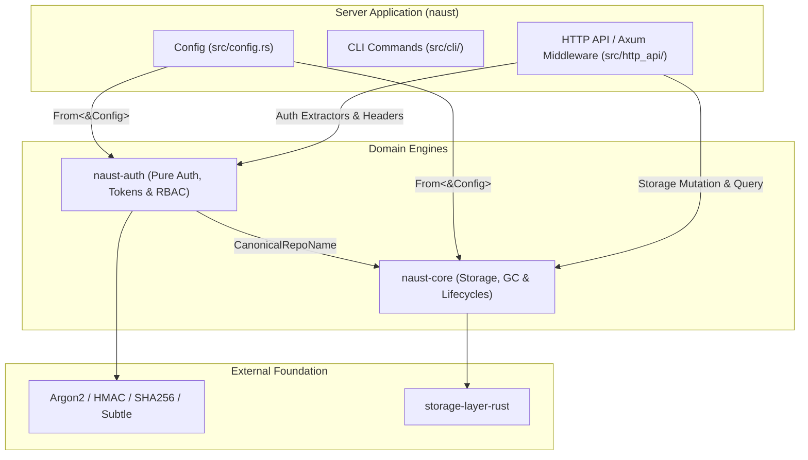

# Plan: Extract `naust-auth` — A Transport-Free Authentication & RBAC Crate

- **Status:** **PROPOSED / READY FOR EXECUTION**
- **Date:** 2026-09-27
- **Author:** Senior Software Architect
- **Target Topology:** Cargo workspace member `crates/naust-auth` (or `vendor/naust-auth`) + `naust` (binary server / CLI)

---

## 1. Executive Summary & Architectural Goals

Following the successful extraction of `naust-core` (ADR-010), the storage and lifecycle domain is strictly *transport-, auth-, and config-free*. However, the authentication and authorization subsystem (~3,300 lines of code) currently resides inside the top-level binary crate `naust` (`src/`), where cryptographic logic, password hashing, and RBAC matrix evaluations are interleaved with Axum HTTP extractors and the monolithic server `Config`.

### Primary Goals:
1. **Transport-Free & Purely Compute-Bound:** `naust-auth` contains zero HTTP dependencies (`axum`, `http-body`, `hyper`), zero network I/O (`reqwest`, `tokio::net`), and zero filesystem access. All auth decisions are pure, deterministic CPU operations.
2. **Decoupled Configuration:** Replace references to the monolithic `naust::Config` with lightweight, cohesive policy structures (`AuthConfig`, `TokenConfig`, `RbacConfig`).
3. **Hermetic Security Boundary:** Centralize cryptographic operations (Argon2id hashing, HMAC-SHA256 signing, Keyring rotation, constant-time comparisons) in an isolated, easily auditable crate.
4. **Reusability:** Allow offline CLIs, token minters, or proxy sidecars to embed authentication and RBAC without linking server runtimes or AWS SDKs.

---

## 2. Target Crate Architecture & Module Partition

### Crate Topology & Dependency Graph



### Module Layout in `naust-auth`

```
vendor/naust-auth/
├── Cargo.toml
└── src/
    ├── lib.rs                  // Facade, re-exports, prelude
    ├── error.rs                // AuthError, TokenError, RbacPatternError
    ├── rbac.rs                 // RbacRepoPattern, Grant, prefix matching, scope intersection
    ├── token/
    │   ├── mod.rs              // Token module facade
    │   ├── claims.rs           // TokenClaims, TokenScope, Action normalization
    │   ├── keyring.rs          // SigningKey, Keyring, key rotation & overlap windows
    │   ├── signer.rs           // HMAC-SHA256 minting (JWT / OCI Bearer format)
    │   ├── verifier.rs         // Bearer token parser, signature verification, expiry
    │   └── rate_limit.rs       // Fixed-window / sliding rate limiter for /token
    ├── credentials/
    │   ├── mod.rs              // Credentials facade
    │   ├── basic.rs            // Constant-time basic credential verification
    │   ├── password.rs         // Argon2id hashing & sentinel hash timing protection
    │   └── accounts.rs         // RobotAccount, UserAccount, Group models
    ├── policy/
    │   ├── mod.rs              // Policy facade
    │   ├── config.rs           // AuthConfig, TokenConfig, RobotAuthConfig, UserAuthConfig
    │   ├── engine.rs           // AuthDecisionEngine (evaluates token requests & repo access)
    │   └── decision.rs         // AuthDecision, CatalogAccess, TokenDecision, TokenOutcome
    └── test_support.rs         // Deterministic test doubles & credential fixtures (dev/test only)
```

---

## 3. Dependency & Invariant Policy

### Allowed Dependencies for `naust-auth`:
- `naust-core`: Path dependency (strictly for `CanonicalRepoName` and `RepoNameError`).
- `argon2 = "0.5"`: Password hashing.
- `hmac = "0.12"`: HMAC signing.
- `sha2 = { version = "0.10", features = ["compress"] }`: Cryptographic digests.
- `subtle = "2"`: Constant-time comparison primitives.
- `base64 = "0.22"`: Standard URL-safe base64 encoding/decoding.
- `serde = { version = "1", features = ["derive"] }` & `serde_json = "1"`.
- `thiserror = "2"`.
- `time = { version = "0.3", features = ["formatting"] }`: Timestamp validation.
- `uuid = { version = "1", features = ["v4"] }`: JTI generation.
- `tracing = "0.1"`: Event instrumentation.

### Strictly Forbidden in `naust-auth`:
- ❌ **No Axum / Hyper / HTTP Body:** No `axum::extract`, `HeaderMap`, `StatusCode`, or `Response`.
- ❌ **No Async Storage / Network:** No `tokio::net`, `reqwest`, `aws-sdk-s3`, or `sled`.
- ❌ **No `naust::Config`:** All inputs must be passed via dedicated `naust_auth::policy::AuthConfig`.

---

## 4. Phased Implementation Plan

### Phase 0: ADR-019 — Boundary & Contract Specification
1. Document the architecture decision in `docs/adr/adr-019-naust-auth-crate-boundary.md`.
2. Define the exact boundary between HTTP extraction (Axum in `naust`) and domain evaluation (`naust-auth`).
3. Freeze the inventory of moving files and coupling points.

### Phase 1: In-Place Decoupling & Policy Struct Extraction (Single Crate)
*Goal: Decouple security and auth code in `src/` from `&Config` and `HeaderMap` before moving files.*
- **Step 1.1: Policy Configuration Types:**
  - Create `src/auth_policy.rs` (precursor to `naust_auth::policy::config`).
  - Define `AuthConfig`, `TokenConfig`, `RobotAccountsConfig`, `UserAccountsConfig`.
  - Implement `From<&Config> for AuthConfig` in `src/config.rs`.
- **Step 1.2: Signature Narrowing:**
  - Update `verify_direct_basic_access`, `verify_any_basic_credentials`, `basic_allows_catalog`, and `decide_token_scopes_for_request` to take `&AuthConfig` instead of `&Config`.
  - Update all sidecar unit tests to construct `AuthConfig` directly.
- **Step 1.3: Transport / Domain Separation:**
  - Ensure `src/auth.rs` separates credential parsing (from `HeaderMap` / `Authorization<Basic>`) from domain verification (`AuthDecisionEngine`).
  - Verify with `cargo test --lib auth` and `cargo test --lib security`.

### Phase 2: Workspace Setup & Crate Initialization
- **Step 2.1: Initialize `vendor/naust-auth`:**
  - Create `vendor/naust-auth/Cargo.toml` with required dependencies.
  - Add `vendor/naust-auth` to the workspace root `Cargo.toml`.
- **Step 2.2: Move Pure Modules:**
  - Move `src/rbac.rs` -> `vendor/naust-auth/src/rbac.rs`.
  - Move `src/security.rs` -> `vendor/naust-auth/src/token/` & `vendor/naust-auth/src/security.rs`.
  - Move `src/robot_secrets.rs` -> `vendor/naust-auth/src/credentials/password.rs`.
  - Move `src/token_rate_limit.rs` -> `vendor/naust-auth/src/token/rate_limit.rs`.
  - Port `AuthDecisionEngine` and `TokenDecision` into `vendor/naust-auth/src/policy/`.
- **Step 2.3: Wire Server to `naust-auth`:**
  - Add `naust-auth = { path = "vendor/naust-auth" }` to `Cargo.toml`.
  - Replace internal imports in `naust/src/` with `naust_auth::*`.

### Phase 3: Public API Curation & Axum Adapters
- **Step 3.1: Clean Prelude & Documentation:**
  - Expose a clean, curated facade in `naust_auth::prelude::*`.
  - Rustdoc the load-bearing security contracts (Argon2 sentinel execution, constant-time compare, token lifecycle).
- **Step 3.2: HTTP Adapters in `naust`:**
  - `src/http_api/auth_token.rs`: Focuses strictly on query string decoding, Axum state extraction, and JSON response formatting.
  - `src/auth.rs`: Focuses on Axum middleware (`require_auth_middleware`) and `WWW-Authenticate` header formatting.

### Phase 4: Verification, Linting & CI Gates
- **Step 4.1: Automated Allowlist Gate:**
  - Add a check in `Makefile` / CI ensuring `vendor/naust-auth/` contains zero forbidden imports (`axum`, `reqwest`, `tokio::fs`, `tokio::net`).
- **Step 4.2: Full Regression Matrix:**
  - Run `cargo test --workspace`.
  - Run `cargo clippy --all-targets` with 0 warnings.
  - Execute full integration suites (`tests/application_service_tests.rs`, `tests/manifest_lifecycle_tests.rs`, `tests/gc_adversarial_coordination_tests.rs`).

---

## 5. Sizing & Effort Estimation

| Phase | Milestone | Estimated Effort | Risk |
| :---: | :--- | :---: | :---: |
| **Phase 0** | ADR-019 Boundary Specification | 0.5 session | Low |
| **Phase 1** | In-place Policy Struct Decoupling (`From<&Config>`) | 1.0 session | Low |
| **Phase 2** | Crate Creation & Module Migration | 1.0 session | Medium |
| **Phase 3** | Axum HTTP Adapters & API Curation | 1.0 session | Low |
| **Phase 4** | Verification, CI Allowlist Gate & Docs | 0.5 session | Low |
| **Total** | **Full Extraction to Production** | **4.0 sessions** | **Low-Medium** |

---

## 6. Risk Register & Mitigations

| # | Risk | Probability | Impact | Mitigation Strategy |
| :--- | :--- | :---: | :---: | :--- |
| **R1** | **Subtle Security Regressions:** Regressions in constant-time comparisons or sentinel Argon2 hash verification during refactoring. | Low | Critical | Move existing unit and property test suites alongside the modules in `naust-auth`; verify exact parity before and after extraction. |
| **R2** | **HTTP Header Leaks:** Axum types or status codes leaking into `naust-auth`. | Low | Medium | Strict automated CI allowlist check rejecting `axum` and `http` in `naust-auth/Cargo.toml`. |
| **R3** | **Packaging & Vendoring Drift:** Workspace path dependencies breaking offline / container builds. | Medium | Medium | Maintain path dependencies pointing to `vendor/naust-auth` matching `vendor/naust-core`. |

---

## 7. Immediate Next Steps

1. Review and approve this implementation plan.
2. Formulate **ADR-019** in `docs/adr/adr-019-naust-auth-crate-boundary.md`.
3. Proceed with **Phase 1: In-Place Policy Struct Decoupling**.
